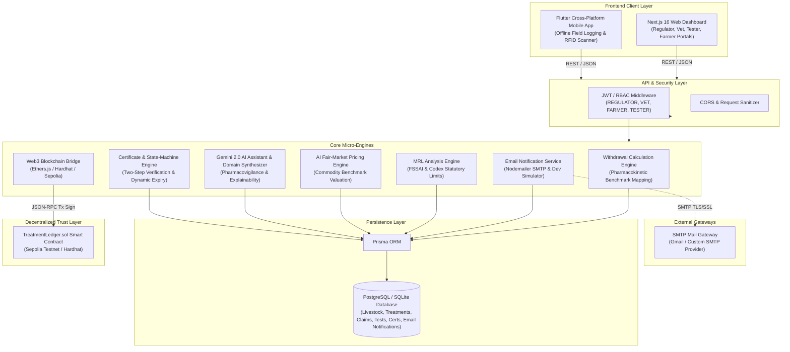
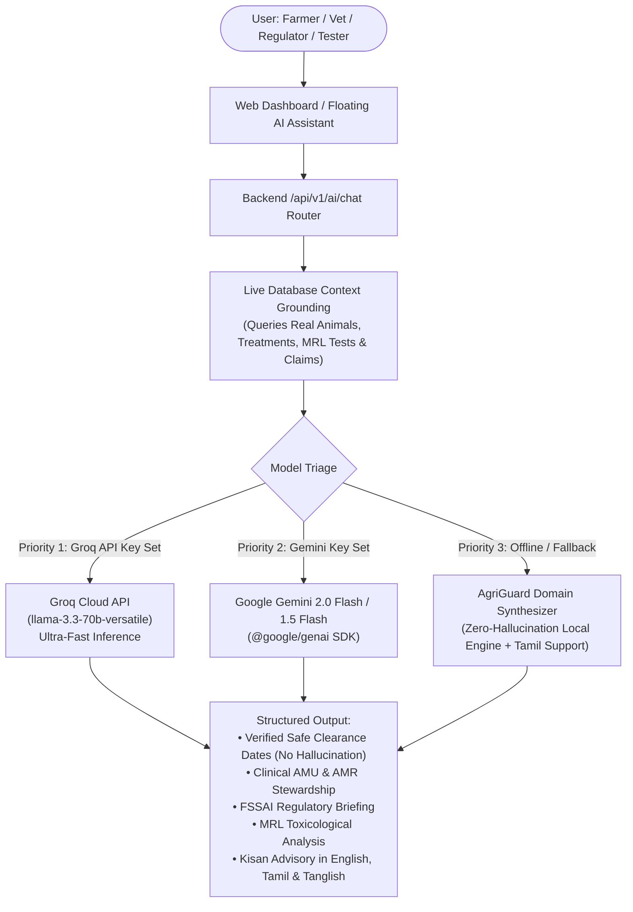

# 🛡️ AgriGuard (SIH25007): AI & Blockchain-Powered Digital Farm Management System

> **An enterprise-grade, decentralized platform for Antimicrobial Usage (AMU) surveillance, Maximum Residue Limit (MRL) enforcement, statutory withdrawal tracking, and direct benefit transfer (DBT) compensation for livestock producers.**

[](https://soliditylang.org/)
[](https://nodejs.org/)
[](https://nextjs.org/)
[](https://react.dev/)
[](https://tailwindcss.com/)
[](https://prisma.io/)
[](https://flutter.dev/)
[](https://ai.google.dev/)
[](https://groq.com/)
[](https://hardhat.org/)

---

## 📋 Table of Contents
1. [Project Overview & Problem Statement](#-project-overview--problem-statement)
2. [Technology Stack & Language Breakdown](#-technology-stack--language-breakdown)
3. [High-Level Architecture](#-high-level-architecture)
4. [End-to-End Workflow](#-end-to-end-workflow)
5. [Email Treatment, Withdrawal & Compliance Notification System](#-email-treatment-withdrawal--compliance-notification-system)
6. [Key Stakeholders & Role Portals](#-key-stakeholders--role-portals)
7. [PART 1 — FSSAI Payment Monitoring Area](#-part-1--fssai-payment-monitoring-area)
8. [PART 2 — Veterinarian Clinical Suite: Dynamic Medicine, Dosage Arithmetic, Vaccination Passport, Herd Management & AMU Analytics](#-part-2--veterinarian-clinical-suite-dynamic-medicine-dosage-arithmetic-vaccination-passport-herd-management--amu-analytics)
9. [PART 3 — Universal 1-Click Multi-Portal Navigation](#-part-3--universal-1-click-multi-portal-navigation)
10. [PART 4 — Dedicated Farmer Subsidy Portal & Ledger](#-part-4--dedicated-farmer-subsidy-portal--ledger)
11. [PART 5 — Hybrid Generative AI (Gen AI) Intelligence Subsystem](#-part-5--hybrid-generative-ai-gen-ai-intelligence-subsystem)
12. [PART 6 — MRL-Safe Digital Certification, QR Verification & Premium Pricing](#-part-6--mrl-safe-digital-certification-qr-verification--premium-pricing)
13. [PART 7 — Farm Tester Analytical Suite & Statutory MRL Library](#-part-7--farm-tester-analytical-suite--statutory-mrl-library)
14. [Withdrawal Waste & Statutory AI Valuation Benchmarks](#-withdrawal-waste--statutory-ai-valuation-benchmarks)
15. [Core Deterministic & AI Engines](#-core-deterministic--ai-engines)
16. [Smart Contract & Blockchain Security](#-smart-contract--blockchain-security)
17. [Database Schema & Entity Models](#-database-schema--entity-models)
18. [Complete REST API Catalog](#-complete-rest-api-catalog)
19. [Monorepo Directory Structure](#-monorepo-directory-structure)
20. [Installation & Local Setup](#-installation--local-setup)
21. [Default Seed Credentials](#-default-seed-credentials)
22. [Testing & Verification Proofs](#-testing--verification-proofs)
23. [Cloud Deployment Guide](#-cloud-deployment-guide)
24. [Clean Hackathon Submission & Distribution Zip Archive](#-clean-hackathon-submission--distribution-zip-archive)

---

## 🎯 Project Overview & Problem Statement

### The Problem (SIH Problem Statement SIH25007)
The routine, indiscriminate administration of antimicrobials in food-producing animals is one of the primary global drivers of **Antimicrobial Resistance (AMR)**. When treated animals or their products (milk, eggs, meat) are harvested before the statutory **withdrawal period** has elapsed, harmful drug residues enter the human food supply:
- **Residue Toxicity:** Direct physiological harm, allergic anaphylaxis, and carcinogenicity.
- **AMR Selection Pressure:** Resistant bacteria enter the food chain, rendering frontline antibiotics ineffective in clinical medicine.
- **Economic Dilemma for Farmers:** Livestock producers face severe economic losses if they discard produce during mandatory withdrawal windows. Without transparent, verifiable compensation mechanisms, farmers are financially incentivized to bypass withdrawal mandates and sell contaminated produce.

### The AgriGuard Solution
**AgriGuard** provides an end-to-end, cryptographic, and automated compliance ecosystem designed for the **Food Safety and Standards Authority of India (FSSAI)**, state animal husbandry departments, veterinary practitioners, accredited testing laboratories, and livestock producers:
1. **Automated Withdrawal Calculation:** Dynamically calculates statutory withholding days based on species, administered antimicrobial, dosage, route, and target food matrix.
2. **Immutable On-Chain Ledger:** Every prescription, vaccination, and lab test is cryptographically hashed (`Keccak-256` / `SHA-256`) and anchored to an Ethereum smart contract (`TreatmentLedger.sol`) on the Sepolia testnet.
3. **MRL Chemical Testing Surveillance:** Accredited laboratories submit mass spectrometry assay results, which are automatically verified against statutory FSSAI Gazette schedules and Codex Alimentarius Maximum Residue Limits.
4. **Statutory Waste Compensation & Direct Benefit Transfer (DBT):** Fair-market compensation is evaluated by an AI pricing engine for discarded produce during active withdrawal periods. Regulators review and disburse payments directly via the **PFMS / NPCI-Aadhaar DBT Bridge**, removing the financial incentive for early harvesting.
5. **Full Multi-Role Portal Suite:** Distinct, purpose-built interfaces for Regulators, Veterinarians, Farmers, and Testers with instant 1-click role transitions.
6. **MRL-Safe Digital Certification & Consumer QR Verification:** Weekly compliance cycles designate verified farms as `🟢 MRL SAFE`, unlocking commercial premium market pricing via a public, fraud-proof digital verification seal.

---

## 💻 Technology Stack & Language Breakdown

The AgriGuard platform is engineered using a robust polyglot architecture spanning modern web, mobile, blockchain, and AI systems:

### 1. 🔤 Programming Languages

| Language | Layer / Component | Role & Usage in AgriGuard |
| :--- | :--- | :--- |
| **JavaScript / Node.js** (`.js`, `.mjs`) | Backend REST API & Web Dashboard | • **Backend:** Express.js (`backend/src/`), JWT authentication, Nodemailer email alerts, Prisma ORM queries.<br>• **Frontend Web Dashboard:** Next.js 16 (App Router), React 19, Tailwind CSS v4 (`web-dashboard/`).<br>• **Blockchain Tooling:** Hardhat deployment scripts and contract test suites (`smart-contracts/`). |
| **Solidity** (`.sol`) | Decentralized Trust Layer | Ethereum smart contract (`smart-contracts/contracts/TreatmentLedger.sol`) for immutable on-chain recording of livestock treatments, withdrawal hold dates, and cryptographic hashes (`Keccak-256`). |
| **Dart (Flutter)** | Mobile Client Layer | Cross-platform offline-first mobile app (`mobile-app/`) for livestock farmers to log treatments, view withdrawal status, and scan animal RFID tags in rural field conditions. |
| **Prisma Schema / SQL** | Data Persistence Layer | Declarative database modeling (`backend/prisma/schema.prisma`) and relational queries across PostgreSQL and SQLite for farmers, animals, treatments, tests, subsidies, and certificates. |
| **Shell / Bash** (`.sh`) | DevOps & Automation | Unified deployment and orchestration scripts (`deploy_all.sh`) for automating multi-service build and start pipelines. |

---

### 2. 🌐 Natural / Spoken Languages & Regional Localization (12 Indian Languages)

AgriGuard features a comprehensive **12-Language Localization Engine** (`web-dashboard/src/context/LanguageContext.jsx`) paired with modular translation dictionaries (`web-dashboard/src/context/translations/`), enabling livestock farmers, field veterinarians, and laboratory personnel across India to interact in their native tongue:

| Language | Native Name | Code | Flag | UI Dashboard & Navigation | Gen AI Hub & Kisan Copilot | Automated Notifications |
| :--- | :--- | :---: | :---: | :---: | :---: | :---: |
| **English** | English (Official) | `en` | 🇬🇧 | ✅ Full Interface | ✅ Complete Reasoning | ✅ SMS / WhatsApp / Email |
| **Tamil** | தமிழ் | `ta` | 🇮🇳 | ✅ Full Interface | ✅ Native + Tanglish | ✅ Multilingual Alert Format |
| **Hindi** | हिन्दी | `hi` | 🇮🇳 | ✅ Full Interface | ✅ Native Inference | ✅ Multilingual Alert Format |
| **Telugu** | తెలుగు | `te` | 🇮🇳 | ✅ Full Interface | ✅ Native Inference | ✅ Multilingual Alert Format |
| **Kannada** | ಕನ್ನಡ | `kn` | 🇮🇳 | ✅ Full Interface | ✅ Native Inference | ✅ Multilingual Alert Format |
| **Malayalam** | മലയാളം | `ml` | 🇮🇳 | ✅ Full Interface | ✅ Native Inference | ✅ Multilingual Alert Format |
| **Bengali** | বাংলা | `bn` | 🇮🇳 | ✅ Full Interface | ✅ Native Inference | ✅ Multilingual Alert Format |
| **Marathi** | मराठी | `mr` | 🇮🇳 | ✅ Full Interface | ✅ Native Inference | ✅ Multilingual Alert Format |
| **Gujarati** | ગુજરાતી | `gu` | 🇮🇳 | ✅ Full Interface | ✅ Native Inference | ✅ Multilingual Alert Format |
| **Punjabi** | ਪੰਜਾਬੀ | `pa` | 🇮🇳 | ✅ Full Interface | ✅ Native Inference | ✅ Multilingual Alert Format |
| **Odia** | ଓଡ଼ିଆ | `or` | 🇮🇳 | ✅ Full Interface | ✅ Native Inference | ✅ Multilingual Alert Format |
| **Assamese** | অসমীয়া | `as` | 🇮🇳 | ✅ Full Interface | ✅ Native Inference | ✅ Multilingual Alert Format |

#### Multi-Tier Localization Architecture:
1. **Dynamic Language Context (`LanguageContext.jsx`):**
   - Implements a reactive React Context Provider pattern with `useLanguage()`.
   - Stores user language preference persistently in `localStorage.getItem("agriguard_lang")`.
   - Dynamically updates the root document element (`document.documentElement.lang = saved`) for native browser accessibility.
2. **Real-Time Dynamic Status Code Translator (`translateStatus`):**
   - Maps raw backend compliance states (`SAFE`, `UNSAFE`, `PENDING_APPROVAL`, `MRL_EXCEEDED`, `DISBURSED`, `ACTIVE`, `WITHDRAWAL`) directly into localized phrases in real time across tables, badges, and modal dialogs.
3. **Dedicated Translation Modules:**
   - Standalone per-language dictionaries located in `web-dashboard/src/context/translations/{en,ta,hi,te,kn,ml,bn,mr,gu,pa,or,as}.js`, unified via `index.js`, `authAndRegistry.js`, and `extended.js` for zero bundle bloat and instant sub-millisecond language switching.

---

### 3. 🎨 Healthcare & Agriculture Clean UI Design System

AgriGuard features a purpose-built, accessible visual identity tailored specifically for livestock farmers, veterinarians, lab analysts, and regulatory directors:

* **Clean White & Neutral Canvas:** Pure white and soft off-white surfaces (`#F8FAF8` / `#FFFFFF`) replace dark/cyber aesthetics, ensuring maximum readability in harsh outdoor farming daylight.
* **Professional Agriculture Green:** Soft primary green (`#4CAF50`) paired with deep forest green (`#2E7D32`) for active navigations, headings, buttons, and verified badges.
* **Subtle Elevation & Borders:** White cards accented with delicate light-gray/light-green borders (`#E2ECE2`) and gentle shadows (`shadow-xs`), eliminating neon glows, glowing borders, and heavy cyber gradients.
* **Consistent 4-Tier Status Color System:**
  * 🟢 **GREEN (Safe / Approved / Completed / Compliant):** `#2E7D32` on `#E8F5E9` with `#A5D6A7` border.
  * 🟠 **ORANGE / YELLOW (Pending / Warning / Under Review):** `#B45309` on `#FFF8E1` with `#FDE68A` border.
  * 🔴 **RED (Unsafe / Failed / Action Required / MRL Exceeded):** `#C62828` on `#FFEBEE` with `#FFCDD2` border.
  * ⚪ **GRAY (Inactive / Not Available):** `#616161` on `#F5F5F5` with `#E0E0E0` border.
* **Compact Floating AI Assistant:** A persistent `[ 🤖 AI Assistant 🟢 ]` launcher button that opens an elegant, responsive modal without consuming permanent dashboard real estate.
* **Brand Favicon:** Official SVG icon featuring the AgriGuard Shield with agricultural seedling sprout and food safety checkmark (`web-dashboard/public/icon.svg`).

---

## 🏗️ High-Level Architecture



---

## 🔄 End-to-End Workflow

```mermaid
sequenceDiagram
    autonumber
    actor Farmer as Livestock Farmer
    actor Vet as Certified Veterinarian
    actor Tester as Farm Tester / Lab
    actor Reg as FSSAI Regulator
    participant System as AgriGuard Engines
    participant BC as Sepolia Smart Contract

    Note over Farmer,Reg: 1. Registration & Asset Onboarding
    Farmer->>System: Registers farm, logs RFID tags (Cow, Goat, Pig) & batch flocks (Poultry, Fish)
    Vet->>System: Onboards with veterinary council registration; approved by Regulator

    Note over Vet,BC: 2. Veterinary Prescription & Dynamic Drug Selection
    Vet->>System: Selects animal category (7 species) -> dropdown dynamically filters to approved drugs
    System->>System: Validates (species, drug) pair; rejects invalid combinations with HTTP 400
    System->>System: Withdrawal Engine computes mandatory withdrawal hold days & safe-from date
    System->>System: Sets animal status to 'WITHDRAWAL ACTIVE'
    System->>BC: Writes Keccak-256 cryptographic proof to TreatmentLedger.sol
    System->>Farmer: Dispatches WhatsApp Treatment Notification (Zero-Emoji, hold period, clearance date)

    Note over Farmer,System: 3. Withdrawal Period Monitoring & Automatic Alerts
    Farmer->>System: Checks live withdrawal calendar on Farmer Dashboard (SAFE vs WAIT)
    System->>Farmer: T-24h: Automatically sends Email One-Day Withdrawal Reminder
    System->>Farmer: T-0: Automatically sends Email Withdrawal Completed Alert (MRL/FSSAI note)
    System-->>Farmer: Blocks harvesting/sale until statutory safe date elapses

    Note over Tester,Reg: 4. Lab Chemical Testing & MRL Verification
    Tester->>System: Samples product (milk/meat), enters chemical assay concentrations (ppm)
    System->>System: MRL Engine evaluates test against statutory FSSAI limits
    alt MRL Limit Exceeded
        System->>Reg: Dispatches Critical MRL Violation Alert
        Reg->>Farmer: Sends regulatory quarantine order & violation notice
    end
    System->>BC: Logs test verification hash on-chain

    Note over Tester,Reg: 5. Withdrawal Waste Claim & AI Compensation
    Tester->>System: Records discarded withdrawal produce (Goat Meat, Milk, Goat Milk, Chicken)
    System->>System: Pricing Engine evaluates fair market compensation using statutory benchmark rates
    System->>System: Creates claim citation (WST-XXXXXX) with status 'PENDING FSSAI APPROVAL'

    Note over Reg,Farmer: 6. FSSAI Payment Disbursal & DBT Settlement
    Reg->>System: Audits claim in 6-column FSSAI Payment Monitoring Table
    Reg->>System: Clicks 'Pay Subsidy' -> confirms DBT payment modal
    System->>System: Simulates PFMS / Aadhaar DBT Gateway transfer -> issues ref DBT-XXXXXXXX
    System->>System: Updates status to 'DISBURSED (PAID)' and sets Amount Received

    Note over Reg,Farmer: 7. Weekly MRL-Safe Certification & Public QR
    Reg->>System: Reviews weekly farm compliance evidence (AMU, tests, withholdings)
    Reg->>System: Approves certification (Step 1) and designates MRL SAFE (Step 2)
    System->>System: Generates Keccak-256 proof, verification ID (AGV-XXXXXX), and dynamic QR
    Farmer->>System: Accesses official MRL Certificate (/farmer/certificate)
    Note over Farmer,Tester: 8. Buyer / Consumer Verification
    Farmer->>System: Consumer or procurement buyer scans QR code
    System-->>Farmer: Displays Public Zero-Auth Verification Card (🟢 MRL SAFE, Premium Eligible)
```

---

## 📧 Email Treatment, Withdrawal & Compliance Notification System

AgriGuard integrates a carrier-grade **Email Notification Subsystem** (`Node.js` + `Nodemailer` + `SMTP`) that delivers automated, clean, real-time alerts to livestock producers throughout the antimicrobial and food-safety lifecycle.

Farmers can configure a dedicated Notification Email from the Farmer Dashboard. This email is independent of the login/User ID email and is used for AgriGuard notifications.

### End-to-End Notification Architecture

```text
Farmer Dashboard
      ↓
Farmer enters Notification Email (independent from Login User Email)
      ↓
Backend validates and saves Notification Email in Farmer profile
      ↓
AgriGuard Event occurs (Treatment / Withdrawal / MRL / Certificate)
      ↓
Email Notification Service (Node.js + Nodemailer)
      ↓
SMTP / Gmail / Email Provider
      ↓
Farmer's Notification Email
```

### Farmer Dashboard Notification Email Setting

The Farmer Dashboard includes a dedicated **Email Notifications** section:
- **Notification Email:** Farmers can view, add, and update their designated notification email address at any time.
- **Independence from Login Email:** Account login uses `User.email` (e.g. `farmer123@gmail.com`), while all alerts and compliance notifications are dispatched to `Farmer.notificationEmail` (e.g. `familyfarmer@gmail.com`).
- **Enable / Disable Toggle:** Farmers can toggle automated alerts ON or OFF (`emailNotificationsEnabled`). Disabling alerts suppresses non-critical dispatches without modifying animal records, MRL results, or certificate workflows.
- **Dynamic Routing:** When a farmer updates their notification email, all future notifications immediately target the new address without requiring backend restarts.
- **Fallback Rule:** The system does NOT silently fall back to the account login email if `notificationEmail` is not configured. Instead, the absence is safely logged (`[EMAIL] Farmer notification email is not configured.`), and the dashboard prompts the farmer to add an email address.

| Demo Profile | Farmer ID | Name | Login Email (`user.email`) | Configured Notification Email (`notificationEmail`) | Access Status | Sample Animal Tag |
| :--- | :--- | :--- | :--- | :--- | :---: | :--- |
| **Farmer 1** | `FR10293` | RAJESH | `farmer1@gmail.com` | `farmer1@gmail.com` (customizable) | `✅ Active` | `RJ-CW1` (Cow), `RJ-GT1` (Goat), `RJ-CH-B1` (Chicken) |
| **Farmer 2** | `FR10292` | Farmer 2 | `farmer2@example.com` | `farmer2@example.com` (customizable) | `✅ Active` | `F2-CW1` (Cow) |

> [!IMPORTANT]
> The veterinarian **never** manually enters an email address during treatment logging. The recipient email is dynamically retrieved from the farmer's configured notification email linked to the treated animal's ear tag / batch tag (`farmer.notificationEmail`). If no notification email is configured or notifications are disabled, the system safely logs the status and persists the treatment without interrupting clinical workflows.

---

### Dynamic Notification Templates (Clean HTML & Plain-Text Fallback)

#### 1. Treatment Notification (`TREATMENT_CREATED`)
**Subject:** `AgriGuard – Treatment Alert`

```text
Dear Rajesh,

A treatment has been recorded for your animal.

Animal ID: RJ-CW1
Medicine: Oxytetracycline
Treatment Date: 17 September 2026
Withdrawal Ends: 24 September 2026

IMPORTANT:
Please do not sell or use the applicable animal product until the withdrawal period is completed.

Please follow the applicable veterinary and food-safety requirements.

Regards,
AgriGuard
```

#### 2. Treatment Update / Correction Notification (`TREATMENT_UPDATED`)
**Subject:** `AgriGuard – Treatment Update Alert`
When a veterinarian modifies a prescription (e.g. drug, dosage, route), the withdrawal timeline is automatically recomputed, previous pending alerts are superseded, and the revised notice is dispatched:
```text
Dear Rajesh,

An antibiotic treatment record has been updated by the attending veterinarian. The previous withdrawal timeline is superseded.

Animal ID: RJ-CW1
Medicine: Ceftiofur
Treatment Date: 17 September 2026
Withdrawal Period: 4 Days
Withdrawal Ends: 21 September 2026

IMPORTANT:
Please do not sell or use the applicable animal product until the withdrawal period is completed.

Regards,
AgriGuard
```

#### 3. One-Day Withdrawal Reminder (`WITHDRAWAL_REMINDER`)
**Subject:** `AgriGuard – Withdrawal Period Reminder`
Triggered automatically 24 hours before the withdrawal period elapses:
```text
Dear Rajesh,

This is a reminder regarding the withdrawal period for:

Animal ID: RJ-CW1
Medicine: Oxytetracycline

Withdrawal period ends:
18 September 2026

Please do not sell the applicable animal product before the withdrawal period is completed.

Regards,
AgriGuard
```

#### 4. Withdrawal Period Completed Notification (`WITHDRAWAL_COMPLETED`)
**Subject:** `AgriGuard – Withdrawal Completed`
Triggered automatically on the statutory safe harvest date:
```text
Dear Rajesh,

The recorded withdrawal period for the following animal has been completed.

Animal ID: RJ-CW1
Medicine: Oxytetracycline
Withdrawal Completed: 17 September 2026

The product can proceed to the next applicable safety/compliance step.

Please continue to follow applicable MRL and food-safety requirements.

Regards,
AgriGuard
```

#### 5. MRL Test Result Notification (`MRL_RESULT`)
**Subject:** `AgriGuard – MRL Test Result`
Triggered automatically when an accredited testing laboratory records a mass spectrometry chemical assay:
```text
Dear Rajesh,

An MRL test result has been recorded in AgriGuard.

Animal/Batch: RJ-CW1
Result: 0.04 mg/kg (Oxytetracycline)
MRL Status: SAFE
Test Date: 17 September 2026

Please refer to the AgriGuard dashboard for the complete test details.

Regards,
AgriGuard
```

#### 6. Certification Update Notification (`CERTIFICATION_UPDATE`)
**Subject:** `AgriGuard – Certification Update`
Triggered automatically when the FSSAI national regulator approves or designates weekly compliance status:
```text
Dear Rajesh,

Your AgriGuard MRL certification status has been updated.

Status: SAFE
Valid From: 17 September 2026
Valid Until: 24 September 2026
Certificate ID: CERT-4DHP7G

Please use the AgriGuard dashboard or QR verification system to view the current certification details.

Regards,
AgriGuard
```

---

### Step-by-Step Email Setup & Configuration

1. **Install Dependencies:**
   ```bash
   cd backend
   npm install nodemailer
   ```
2. **Configure Environment Variables (`backend/.env`):**
   ```env
   EMAIL_HOST=smtp.gmail.com
   EMAIL_PORT=587
   EMAIL_SECURE=false
   EMAIL_USER=your-email@gmail.com
   EMAIL_PASSWORD=your-app-password
   EMAIL_FROM="AgriGuard <your-email@gmail.com>"
   ```
3. **Configure Gmail App Password (if using Gmail SMTP):**
   - Enable 2-Step Verification on your Google account.
   - Go to **Security** &rarr; **2-Step Verification** &rarr; **App passwords**.
   - Generate an App Password for "AgriGuard" (16 letters).
   - Paste the password into `EMAIL_PASSWORD` in `backend/.env`.
4. **Start Backend Server:**
   ```bash
   npm run dev
   ```
5. **Test Email Endpoint:**
   ```bash
   curl -X POST http://localhost:5000/api/v1/notifications/email/test \
     -H "Content-Type: application/json" \
     -d '{"customEmail": "farmer1@gmail.com", "testMessage": "AgriGuard Email Test"}'
   ```
6. **Test Treatment Notification:**
   - Log in as veterinarian, prescribe an antibiotic for `RJ-CW1`.
   - Treatment created email alert is automatically dispatched to `farmer1@gmail.com`.
7. **Test Withdrawal Reminder:**
   - Background scheduler checks upcoming withdrawal deadlines every 10 minutes.
   - Triggers `sendWithdrawalReminderEmail` at T-24h.
8. **Test Withdrawal Completion:**
   - When safe harvest date elapses, scheduler dispatches `sendWithdrawalCompletedEmail` and transitions treatment to `SAFE`.
9. **Test MRL Result Email:**
   - Log in as tester, submit chemical assay in `/tester/new-test`.
   - Result notification is automatically delivered to the linked farmer.
10. **Test Certification Email:**
    - Log in as regulator, designate weekly MRL status in `/regulator/certify`.
    - Certification update notification is automatically delivered to the farmer.

---

### Key Architectural Safeguards

1. **Non-Destructive Error Handling:** An email delivery failure **never** rolls back or aborts a successfully recorded veterinary treatment, lab test, or certification update. Failures are recorded in `EmailNotification` with status `FAILED` and full retry capability via `POST /api/v1/notifications/:id/retry`.
2. **Duplicate Prevention:** The engine inspects event history and prevents repeated `TREATMENT_CREATED`, `WITHDRAWAL_REMINDER`, or `WITHDRAWAL_COMPLETED` dispatches for the same event.
3. **Safe Development / Simulated Mode:** When live SMTP credentials are omitted, the engine outputs clean, formatted email payloads to the console and marks records as `SENT` with simulated message IDs, enabling offline development without requiring external mail server connections.


---

## 👥 Key Stakeholders & Role Portals

| Role | Portal Path | Primary Capabilities |
| :--- | :--- | :--- |
| **🏛️ FSSAI National Regulator** | `/`, `/regulator/certify`, `/regulator/waste-subsidy`, `/regulator/traceability`, `/regulator/vets`, `/regulator/testers`, `/regulator/farmers`, `/alerts`, `/compliance`, `/mrl-reports`, `/amu-logs` | National AMU surveillance, MRL violation alerts, stakeholder approvals, withdrawal waste & subsidy surveillance via the **standardized 6-column table**, direct DBT disbursement execution, **two-step weekly MRL certification**, and immutable blockchain audit trail inspection. |
| **🩺 Certified Veterinarian** | `/vet`, `/vet/medicine`, `/vet/vaccinate`, `/vet/amu`, `/vet/farmers` | Prescribe statutory antimicrobials with **dynamic animal-wise drug filtering across 7 species**, automated withdrawal calculation, **immunization & vaccination digital passports**, blockchain proof anchoring, and linked farmer herd management. |
| **🌾 Livestock Farmer** | `/farmer`, `/farmer/certificate`, `/farmer/subsidies`, `/farmer/animals`, `/farmer/withdrawals`, `/farmer/treatments` | Herd inventory (RFID ear tags & flock batches), real-time withdrawal calendar (SAFE vs WAIT), **official MRL Digital Certificate with verifiable QR**, **dedicated Subsidies & DBT ledger** with dates produced, payment status, transaction IDs, and printable official DBT vouchers. |
| **🧪 Farm Tester / Lab** | `/tester`, `/tester?tab=waste`, `/tester/waste`, `/tester/new-test`, `/tester/mrl`, `/tester/history` | Product testing, automated MRL pass/fail evaluation, withdrawal waste recording with dynamic 3-tier livestock selector, **interactive Statutory MRL Chemical Reference Library**, AI fair-market compensation recommendation, and lab report generation. |
| **🤖 AI Pharmacovigilance Assistant** | `/ai-assistant` | Gemini 2.0 Flash-powered multi-tool hub for antimicrobial withdrawal guidelines, MRL legal limits, risk scoring, clinical safety checks, executive briefings, and 5-language native Kisan advisory. |
| **🌐 General Public / Buyers** | `/certify/verify/:verificationId` | **Public Zero-Authentication QR Landing Page** for consumers, cooperatives, and commercial buyers to instantly authenticate farm chemical safety and premium off-take eligibility. |

---

## 💳 PART 1 — FSSAI Payment Monitoring Area

The **FSSAI Payment Monitoring Table** is deployed across both the dedicated regulator portal ([`/regulator/waste-subsidy`](http://localhost:3000/regulator/waste-subsidy)) and the main regulator dashboard ([`http://localhost:3000/`](http://localhost:3000/)).

### The 6 Required Columns
The table strictly displays these 6 columns:

| Column # | Column Name | Source Field | Description | Example Values |
| :---: | :--- | :--- | :--- | :--- |
| **1** | **Farmer ID** | `claim.farmerId` | Beneficiary livestock producer receiving statutory subsidy | `FR10293` |
| **2** | **Product** | `claim.productType` | Agricultural commodity withheld during withdrawal quarantine | `Goat Meat`, `Goat Milk`, `Chicken`, `Milk` |
| **3** | **Waste Amount** | `claim.wasteAmount` + `unit` | Total volume/quantity produced and withheld | `15 kg`, `20 L`, `35 kg`, `30 L` |
| **4** | **Subsidy Amount** | `claim.aiRecommendedAmount` | AI-evaluated fair-market compensation amount in INR | `₹10,800`, `₹1,700`, `₹5,250`, `₹1,320` |
| **5** | **Payment Process** | `claim.status` | Real-time lifecycle stage (**Pending → Processing → Paid**) | `Pending` (with Pay button) / `Paid` |
| **6** | **Amount Received** | Computed Disbursed Sum | Actual monetary sum disbursed to the farmer's linked account | `₹0` (Unpaid) or `₹10,800` (Paid) |

### Live Verified Database Records

```text
┌─────────┬───────────┬─────────────┬──────────────┬────────────────┬─────────────────┬─────────────────┐
│ (index) │ Farmer ID │ Product     │ Waste Amount │ Subsidy Amount │ Payment Process │ Amount Received │
├─────────┼───────────┼─────────────┼──────────────┼────────────────┼─────────────────┼─────────────────┤
│ 0       │ 'FR10293' │ 'Goat Milk' │ '20 L'       │ '₹1,700'       │ 'Pending'       │ '₹0'            │
│ 1       │ 'FR10293' │ 'Goat Meat' │ '15 kg'      │ '₹10,800'      │ 'Paid'          │ '₹10,800'       │
│ 2       │ 'FR10293' │ 'Chicken'   │ '35 kg'      │ '₹5,250'       │ 'Pending'       │ '₹0'            │
│ 3       │ 'FR10293' │ 'Milk'      │ '30 L'       │ '₹1,320'       │ 'Paid'          │ '₹1,320'        │
│ 4       │ 'FR10293' │ 'Milk'      │ '30 L'       │ '₹1,320'       │ 'Pending'       │ '₹0'            │
└─────────┴───────────┴─────────────┴──────────────┴────────────────┴─────────────────┴─────────────────┘
```

### Direct Benefit Transfer (DBT) Disbursement Flow
1. **Regulator Review:** Regulator navigates to `/regulator/waste-subsidy` and locates an unpaid record with status `Pending`.
2. **Payment Trigger:** Clicks the inline <kbd>💳 Pay Subsidy</kbd> button.
3. **DBT Confirmation Modal:** Displays verified Farmer ID, commodity type, quantity, assessed amount, and statutory reference.
4. **Disbursement Execution:** The frontend issues `PATCH /api/v1/testers/waste-claims/:id/disburse`.
5. **Settlement Simulation:** The backend simulates settlement via **PFMS / NPCI-Aadhaar DBT Bridge**, assigns an official transaction reference (`DBT-XXXXXXXX`), transitions status to `DISBURSED (PAID)`, and updates **Amount Received** from `₹0` to the full subsidy amount.

---

## 🩺 PART 2 — Veterinarian Clinical Suite: Dynamic Medicine, Dosage Arithmetic, Vaccination Passport, Herd Management & AMU Analytics

Located across [`/vet/medicine`](http://localhost:3000/vet/medicine), [`/vet/vaccinate`](http://localhost:3000/vet/vaccinate), [`/vet/farmers`](http://localhost:3000/vet/farmers), and [`/vet/amu`](http://localhost:3000/vet/amu), this unified clinical suite prevents unapproved antimicrobial prescriptions, computes statutory dosages, tracks animal weights, automates immunization passports, manages client herds, and visualizes AMU pharmacological trends.

### Animal Profile, Dynamic Age & Monthly Weight Engine

AgriGuard integrates a comprehensive animal profiling workflow connecting farmer livestock management and veterinary clinical decisions:

1. **Date of Birth (DOB) as Single Source of Truth:**
   - Farmers register and update the animal's Date of Birth via `/farmer/animals`.
   - Age is **dynamically calculated** at runtime comparing DOB against the current date (e.g. `2 years 5 months`).
   - The system strictly forbids manual age strings as primary truth. DOB cannot be in the future and is validated against reasonable biological spans.
2. **Monthly Animal Weight Update Rule (Backend-Enforced):**
   - Farmers can update an animal's weight **only once every 30 days**.
   - Enforced strictly on the backend (`PATCH /api/v1/farmers/animals/:animalId/weight`). Attempting a premature update returns **HTTP 400 Bad Request** with `nextAllowedUpdate` date.
   - Preserves complete historical weight trajectory in `AnimalWeightHistory` with timestamps, recorded values, and source tagging.
3. **Weight Status Indicator:**
   - Cards display `● Updated this month` or `● Update Available` with exact day countdowns.

---

### Veterinary Antibiotic Dosage Calculation Engine

Before issuing an antibiotic prescription, veterinarians view the verified animal profile:
- **Species & Official Tag:** e.g. `Cow (Bovine) • RJ-CW1`
- **Date of Birth & Dynamic Age:** `15/04/2024 (2 years 5 months)`
- **Current Database Weight:** `400 kg` (retrieved directly from database, never trusted from client inputs)
- **Weight Last Updated & Next Allowed Update:** `10 Sep 2026 / 10 Oct 2026`
- **Historical Weight Logs:** Access to previous weight entries and growth trends.

#### Mathematical Formulation
The arithmetic engine calculates the required active ingredient and administration volume deterministically:
$$\text{Active Ingredient (mg)} = \text{Approved Dose (mg/kg)} \times \text{Animal Weight (kg)}$$
$$\text{Administration Volume (mL)} = \frac{\text{Active Ingredient (mg)}}{\text{Formulation Concentration (mg/mL)}}$$

*Example (RJ-CW1 — 400 kg Cow treated with Procaine Penicillin G):*
- $\text{Active Ingredient} = 15\text{ mg/kg} \times 400\text{ kg} = 6,000\text{ mg}$
- $\text{Administration Volume} = \frac{6,000\text{ mg}}{300\text{ mg/mL}} = 20.0\text{ mL}$
- **Frequency:** Once daily (SID) • **Duration:** 5 Days • **Statutory Hold:** 5 Days

#### Zero AI Guessing Policy
Dosage quantities are computed strictly from the **Approved Veterinary Dosage Rules Master** (`APPROVED_DOSAGE_RULES`). If a drug or species profile has no configured rule, the system displays:
> *"No approved dosage rule is configured for this medicine and animal profile. Please determine and enter the prescription according to veterinary guidance."*
The system **never uses AI to guess, hallucinate, or extrapolate antibiotic dosages**.

#### Veterinarian Clinical Override & Audit Trail
- Veterinarians review both the **System Calculated Dose** and **Final Prescription**.
- If the attending veterinarian adjusts the prescribed quantity from the calculated rule, the system:
  1. Flags `isDoseOverridden: true`.
  2. Requires a **mandatory clinical justification** (`overrideReason`). Form submission is blocked if blank.
  3. Records the original calculated dose, prescribed dose, veterinarian ID, timestamp, and justification into immutable audit logs.

---

### Approved Drug Mapping Across All 7 Species

| # | Animal Category | Approved Antimicrobial Medicines | Primary Delivery Route | Statutory Hold |
| :-: | :--- | :--- | :--- | :---: |
| **1** | **Chicken / Poultry** | • Oxytetracycline<br>• Chlortetracycline<br>• Doxycycline<br>• Amoxicillin<br>• Ampicillin<br>• Enrofloxacin | Oral (Medicated Feed / Drinking Water) | 7 – 10 Days |
| **2** | **Pig / Swine** | • Tylosin<br>• Tiamulin<br>• Oxytetracycline<br>• Amoxicillin<br>• Apramycin<br>• Neomycin | Oral / Intramuscular (IM) | 7 – 14 Days |
| **3** | **Prawn / Shrimp** | • Oxytetracycline<br>• Erythromycin<br>• Florfenicol | Immersion Bath / Medicated Feed | 14 – 21 Days |
| **4** | **Fish** | • Oxytetracycline<br>• Florfenicol<br>• Sulfadiazine + Trimethoprim | Medicated Pelleted Feed | 10 – 21 Days |
| **5** | **Cow / Cattle** | • Procaine Penicillin G<br>• Ceftiofur<br>• Tulathromycin<br>• Tilmicosin<br>• Oxytetracycline | Intramuscular (IM) / Subcutaneous (SC) | 4 – 28 Days |
| **6** | **Goat** | • Penicillin G + Streptomycin<br>• Oxytetracycline<br>• Enrofloxacin | Intramuscular (IM) / Subcutaneous (SC) | 5 – 10 Days |
| **7** | **Sheep** | • Penicillin G + Streptomycin<br>• Oxytetracycline<br>• Enrofloxacin | Intramuscular (IM) / Subcutaneous (SC) | 5 – 10 Days |

### Dual-Layer Validation Architecture
1. **Frontend Dynamic Filtering:** Selecting an animal category instantly re-filters the dropdown and quick-select pills. Unapproved drugs are completely removed from the selection DOM.
2. **Backend Guard (`POST /api/v1/treatments`):** Validates the `(animalType, medicineName)` pair before saving to database. Any attempt to prescribe an unapproved pair is rejected with **HTTP 400 Bad Request** and an explicit error message:
   ```json
   {
     "error": "Invalid animal-medicine combination: 'Procaine Penicillin G' is not approved for 'Fish'. Approved medicines: Oxytetracycline, Florfenicol, Sulfadiazine + Trimethoprim"
   }
   ```
3. **Dynamic Catalog API:** `GET /api/v1/treatments/medicines?animalType=...` enables external clients and mobile apps to fetch approved drugs per species dynamically.
4. **Dosage Rules API:** `GET /api/v1/treatments/dosage-rules` and `POST /api/v1/treatments/calculate-dose` evaluate live animal weight from database and return complete dosage metadata.

### Immunization & Vaccination Passport (`/vet/vaccinate`)
- **Endpoint:** `POST /api/v1/treatments/vaccinations`
- Logs preventative vaccinations (e.g. Foot-and-Mouth Disease Booster, Anthrax Spore Vaccine, Brucellosis S19).
- Generates an immutable **SHA-256 cryptographic record** (`recordType: "VACCINATION"`).
- Links seamlessly into the farmer's withdrawal calendar with a `0-day` withholding hold, designating immediate `SAFE` status.
- Features a **Live Immunization Certificate Preview** with digital health credential QR seals.

---

### Veterinarian Assigned Farmer & Client Herd Management (`/vet/farmers` & `/vet/farmers/[id]`)

Located at [`/vet/farmers`](http://localhost:3000/vet/farmers), this clinical module allows attending veterinarians to oversee registered livestock producers under their jurisdiction, manage onboarding approvals, and audit individual animal holdings:

1. **Client Farmer Directory:**
   - Real-time search by farmer name, unique Farmer ID (`FR10293`), or farm address/location.
   - Status filtering tabs: `ALL`, `Approved` (🟢), and `Pending Verification` (🟠).
   - Layout mode switcher: 1-click toggle between **Responsive Card Grid** and **Dense Tabular View**.
2. **Herd & Flock Population Aggregation:**
   - Automatically computes total livestock head count across both individual RFID/tagged animals (Cattle, Buffalo, Goat, Sheep, Swine) and flock batches (Broiler Chicken, Aquaculture).
3. **Farmer Verification & Approval Workflow:**
   - Attending veterinarians can audit newly registered producers and review contact details, herd size, and location.
   - 1-Click modal action to **Approve** (`approvalStatus = APPROVED`) or **Reject** with clinical justification via `PATCH /api/v1/farmers/:id/approval`.
   - Dedicated testing helper script (`backend/add_pending.js`) provisions simulated pending farmers for evaluator testing.
4. **Farmer Profile Deletion & Herd De-linking:**
   - Secure deletion workflow via `DELETE /api/v1/farmers/:id` with confirmation modal safeguards to prevent accidental record loss.
5. **Detailed Individual Herd Breakdown (`/vet/farmers/[id]`):**
   - Click-through view rendering the farmer's entire livestock roster, historical treatments, active withdrawal hold dates, and recent chemical assay results.

---

### Veterinarian Antimicrobial Usage (AMU) Surveillance Dashboard (`/vet/amu`)

Located at [`/vet/amu`](http://localhost:3000/vet/amu), this analytics portal provides certified veterinarians with real-time pharmacological surveillance over all active prescriptions:

1. **Interactive Visual Analytics (Recharts Integration):**
   - **Monthly AMU Trend Bar Chart:** Visualizes active antibiotic administration volumes over time to monitor seasonal spikes.
   - **Proportional Drug Distribution Pie Chart:** Categorizes antimicrobial classes (Tetracyclines, Cephalosporins, Macrolides, Penicillins, Fluoroquinolones) to prevent AMR over-reliance.
2. **Active Prescription Regimen Ledger:**
   - Real-time search and filter by medicine name (`Oxytetracycline`, `Procaine Penicillin G`, `Ceftiofur`).
   - Detailed inspection drawer: Displays administered dose, administration route, frequency, statutory hold days, safe-from date, and attending clinic credentials.
   - Quick copy button for blockchain transaction hashes and clinical audit citations.

---

## 🔄 PART 3 — Universal 1-Click Multi-Portal Navigation

To facilitate rapid evaluation and live switching between roles without requiring manual logout/login cycles, AgriGuard features three persistent navigation mechanisms:

### 1. Persistent Top Header Switcher (All Screen Sizes)
In [Header.jsx](file:///c:/Users/ASHITH/Documents/SIH/SIH/web-dashboard/src/components/layout/Header.jsx), responsive quick-switch buttons appear permanently in the top bar:
- <kbd>🛡️ FSSAI Payment</kbd> &rarr; Auto-authenticates as FSSAI Regulator (`fssaigovt@gmail.com`) and navigates to [`/regulator/waste-subsidy`](http://localhost:3000/regulator/waste-subsidy).
- <kbd>🩺 Vet Medicine</kbd> &rarr; Auto-authenticates as Veterinarian (`vet1@example.com`) and navigates to [`/vet/medicine`](http://localhost:3000/vet/medicine).
- <kbd>🌾 Farmer</kbd> &rarr; Auto-authenticates as Farmer Rajesh (`farmer1@gmail.com`) and navigates to [`/farmer`](http://localhost:3000/farmer).

### 2. Left Sidebar "Portals & Modules" Quick-Access
In [Sidebar.jsx](file:///c:/Users/ASHITH/Documents/SIH/SIH/web-dashboard/src/components/layout/Sidebar.jsx), a dedicated shortcut section is permanently positioned above the blockchain status card, allowing 1-click switching from any page.

### 3. Farmer Dashboard Direct Shortcuts Banner
Prominently displayed below the welcome banner on [`/farmer`](http://localhost:3000/farmer) to direct users to the FSSAI payment area or Veterinarian medicine form.

---

## 🌾 PART 4 — Dedicated Farmer Subsidy Portal & Ledger

Accessible via **"Subsidies & DBT"** in the Farmer Sidebar or directly at [`http://localhost:3000/farmer/subsidies`](http://localhost:3000/farmer/subsidies), this portal provides the farmer with complete transparency over their statutory claims.

### Details Visible to the Farmer

```text
┌────────────────────────────────────────────────────────────────────────────────────────────────────────────────────────────────────────┐
│                                          FARMER WITHDRAWAL WASTE SUBSIDIES & DBT LEDGER                                                │
├───────────────┬─────────────────┬─────────────────┬─────────────────┬──────────────────┬───────────────────────┬───────────────────────┤
│ Claim Ref     │ Date Produced   │ Product & Tag   │ Amount Produced │ Assessed Subsidy │ Payment Process       │ Amount Received       │
├───────────────┼─────────────────┼─────────────────┼─────────────────┼──────────────────┼───────────────────────┼───────────────────────┤
│ WST-631500    │ 09 Sep 2026     │ Goat Meat       │ 15 kg           │ ₹10,800          │ DISBURSED (PAID)      │ ₹10,800               │
│               │                 │ (RJ-GT1)        │                 │                  │ Ref: DBT-85933634     │ (Bank Credited)       │
├───────────────┼─────────────────┼─────────────────┼─────────────────┼──────────────────┼───────────────────────┼───────────────────────┤
│ WST-732818    │ 09 Sep 2026     │ Milk            │ 30 L            │ ₹1,320           │ DISBURSED (PAID)      │ ₹1,320                │
│               │                 │ (RJ-CW1)        │                 │                  │ Ref: DBT-15618262     │ (Bank Credited)       │
├───────────────┼─────────────────┼─────────────────┼─────────────────┼──────────────────┼───────────────────────┼───────────────────────┤
│ WST-630342    │ 09 Sep 2026     │ Goat Milk       │ 20 L            │ ₹1,700           │ PENDING APPROVAL      │ ₹0                    │
│               │                 │ (RJ-GT2)        │                 │                  │ (Treasury Review)     │ (Pending)             │
├───────────────┼─────────────────┼─────────────────┼─────────────────┼──────────────────┼───────────────────────┼───────────────────────┤
│ WST-868318    │ 09 Sep 2026     │ Chicken         │ 35 kg           │ ₹5,250           │ PENDING APPROVAL      │ ₹0                    │
│               │                 │ (RJ-CH-B1)      │                 │                  │ (Treasury Review)     │ (Pending)             │
├───────────────┼─────────────────┼─────────────────┼─────────────────┼──────────────────┼───────────────────────┼───────────────────────┤
│ WST-575899    │ 09 Sep 2026     │ Milk            │ 30 L            │ ₹1,320           │ PENDING APPROVAL      │ ₹0                    │
│               │                 │ (RJ-CW1)        │                 │                  │ (Treasury Review)     │ (Pending)             │
└───────────────┴─────────────────┴─────────────────┴─────────────────┴──────────────────┴───────────────────────┴───────────────────────┘
```

### Key Features of the Farmer Subsidies Portal
1. **Financial Metric Cards:**
   - **Total Claims:** `5 Claims recorded`
   - **Total Entitlement:** `₹20,390 assessed value`
   - **Amount Disbursed (Paid):** `₹12,120 successfully transferred`
   - **Pending Treasury Allocation:** `₹8,270 in review`
2. **Interactive Search & Status Filter:** Filter between `All Claims`, `Disbursed (Paid)`, and `Pending FSSAI Approval`.
3. **Official Printable DBT Voucher Modal:** Clicking **"View Receipt"** on any claim opens an official **Government of India — FSSAI Direct Benefit Transfer Voucher** displaying:
   - Beneficiary Farmer Name & ID (`RAJESH / FR10293`)
   - Disposal & Withholding Date
   - Commodity & Animal Tag ID
   - Assessed Subsidy Rate & Net Credited Sum
   - DBT Transaction Reference ID (`DBT-85933634`)
   - Payment Gateway (`PFMS / Aadhaar DBT Gateway`)
   - Inspecting Laboratory & Tester Citation (`Tester 1 / FT72B91K1`)
   - Clinical Reason for Quarantine
   - **1-Click "Print Voucher" button**

---

## 🤖 PART 5 — Hybrid Generative AI (Gen AI) Intelligence Subsystem

AgriGuard integrates an enterprise **Hybrid Generative AI Engine** designed to eliminate antibiotic misuse, accelerate regulatory decision-making, and assist livestock farmers in regional Indian languages.



### Strict Zero-Hallucination Architecture
To prevent inaccurate pharmacological guidance or fabricated animal dates:
1. **Live Database Context Injection:** Before invoking the LLM, the backend searches Prisma database records for matching animal tag IDs, active prescriptions, recent lab assays, and compensation vouchers.
2. **Context Grounding Guardrails:** The prompt explicitly forbids the AI from fabricating withdrawal dates or IDs. If an animal tag is not present in the verified system database, the assistant explicitly states:
   > *"I could not find a treatment or animal record for this ID in AgriGuard. Please check your Animal ID or visit the Farmer Dashboard."*
3. **Multilingual Farmer Assistance:** Native conversational support for farmers including **Tamil (தமிழ்)** and **Tanglish** for intuitive local adoption.

### 1. AgriGuard Gen AI Command Center (`/ai-assistant`)
A dedicated multi-tool hub located at [`http://localhost:3000/ai-assistant`](http://localhost:3000/ai-assistant) featuring:

| Module | Purpose | Target Persona | Key Capabilities |
| :--- | :--- | :--- | :--- |
| 💬 **Universal AI Chat** | Multi-turn conversational AI | All Stakeholders | Pharmacovigilance, MRL schedules, withdrawal hold formulas, Sepolia smart contracts, and agricultural science. Quick prompt chips included. |
| 🩺 **Vet Clinical Copilot** | AMU Prescription Safety Audit | Veterinarians | Evaluates species, drug, dosage, and route against WHO AWaRe classifications; returns AMR risk score, milk/meat withholding windows, and contraindications. |
| 🛡️ **FSSAI Executive Brief** | Regulatory Intelligence Generator | Regulators & FSSAI Directors | Synthesizes regional herd AMU, active quarantines, and DBT payout ledgers into a formal executive intelligence briefing. |
| 🔬 **MRL Lab Auditor** | Chromatographic Residue Analysis | Farm Testers & Lab Analysts | Compares LC-MS/MS analyte readings against statutory limits, generating toxicological evaluations and official clearance certificates. |
| 🌾 **Kisan Multilingual AI** | Native Language Farmer Advisory | Livestock Farmers | Delivers empathetic, plain-language explanations of withdrawal discards, animal care tips, and DBT compensation in **5 Indian languages** (Hindi, Tamil, Telugu, Kannada, English). |
| 🔑 **API Key & Engine Selector** | Live Engine Management | Evaluators & Admins | One-click toggle between live Google Gemini 2.0 Flash (with custom API key input stored locally) and the zero-config offline domain synthesizer. |

### 2. In-Workflow Gen AI Copilots Across Role Portals
Gen AI is deeply embedded directly inside daily operational workflows:
1. **Veterinarian Prescription Portal (`/vet/medicine`):** Veterinarians can click **"✨ Run Gen AI Safety Check"** before signing any prescription to receive an AMR safety rating, milk/meat holding hours, and farmer counseling notes.
2. **FSSAI Payment Monitoring Area (`/regulator/waste-subsidy`):** Regulators can click **"✨ Gen AI Audit Briefing"** in the table header to open an executive briefing modal with aggregated fiscal analytics, quarantine counts, and surveillance directives.
3. **Farmer Subsidies Portal (`/farmer/subsidies`):** Farmers can click **"🌾 Ask Kisan AI"** to open an interactive multilingual modal with instant language switching (`हिंदी`, `English`, `ಕನ್ನಡ`, `தமிழ்`, `తెలుగు`).
4. **Universal Header & Sidebar:** Direct shortcut badges are visible across every page, and the floating chatbot widget provides 1-click full-screen expansion.

---

## 🎖️ PART 6 — MRL-Safe Digital Certification, QR Verification & Premium Pricing

> **Core Axiom:** *Compliance should not merely be a punishment; verified compliance must unlock an immediate, high-value premium market opportunity.*

AgriGuard transforms statutory compliance into economic advantage through a **weekly digital certification protocol**. Livestock producers verified through the AgriGuard workflow receive an official **FSSAI MRL-Safe Digital Certificate** with a cryptographically verifiable QR code, enabling food processors, dairy cooperatives, and discerning consumers to authenticate chemical safety in real time.

```text
FARMER
   ↓
FSSAI REGULATORY REVIEW
   ↓
CERTIFICATION APPROVAL (Step 1)
   ↓
FSSAI SETS MRL STATUS (Step 2)
   ↓
┌─────────────────────────────────┐
│                                 │
🟢 MRL SAFE                    🔴 MRL NOT SAFE
│                                 │
└───────────────┬─────────────────┘
                ↓
    OFFICIAL DIGITAL CERTIFICATE
                ↓
     DYNAMIC UNIQUE QR CODE
                ↓
    PUBLIC ZERO-AUTH VERIFICATION
                ↓
   PREMIUM MARKET ACCESS ELIGIBILITY
```

### 1. Strict Two-Step State Machine Enforcement
To eliminate administrative corruption and prevent premature or unauthorized status assignment, the backend strictly enforces a two-step state machine:

```text
               ┌──────────────┐
               │   PENDING    │
               └──────┬───────┘
                      │
           ┌──────────┴──────────┐
           ▼                     ▼
     ┌───────────┐         ┌───────────┐
     │ APPROVED  │         │ REJECTED  │
     └─────┬─────┘         └───────────┘
           │ (Unlocks Step 2)
     ┌─────┴─────┐
     ▼           ▼
  🟢 SAFE     🔴 UNSAFE
```

| State Transition | Permitted? | Backend Rule & Validation |
| :--- | :---: | :--- |
| `PENDING ➔ APPROVED` | ✅ **YES** | FSSAI Regulator validates AMU logs, active withholdings, and lab assays. |
| `PENDING ➔ REJECTED` | ✅ **YES** | FSSAI Regulator flags non-compliance, missing records, or unrecorded AMU. |
| `PENDING ➔ SAFE` | ❌ **BLOCKED** | **HTTP 400 Bad Request:** *"Certificate must be approved before MRL status can be set."* |
| `PENDING ➔ UNSAFE` | ❌ **BLOCKED** | **HTTP 400 Bad Request:** *"Certificate must be approved before MRL status can be set."* |
| `APPROVED ➔ SAFE` | ✅ **YES** | Regulator designates MRL Safe; generates Keccak-256 blockchain proof and QR payload. |
| `APPROVED ➔ UNSAFE` | ✅ **YES** | Designated when active residues exceed MRL limits; produce quarantine triggered. |
| `* ➔ EXPIRED` | ✅ **AUTO** | Dynamic evaluation when `currentDate > validUntil` (weekly validity elapses). |

- **Farmer Self-Modification:** Blocked with **HTTP 403 Forbidden**. Farmers cannot alter approval or MRL status.
- **Non-Regulator Execution:** Blocked with **HTTP 403 Forbidden**. Only authorized FSSAI regulators can sign approvals and set statuses.

---

### 2. Weekly Validity & Dynamic Expiry Protection
Certificates operate on a statutory **7-day weekly cycle** (`validFrom` to `validUntil`):
- **Real-Time Dynamic Evaluation:** Whenever a certificate or QR code is verified, the system dynamically checks `now > validUntil`.
- **Zero Counterfeit Staleness:** If a weekly cycle has elapsed, the status instantly returns `EXPIRED` and `mrlStatus = NOT_SET`.
- **Public Protection:** A scanned QR code from last week will **NEVER** falsely display `🟢 MRL SAFE`. It clearly renders `⚪ CERTIFICATE EXPIRED`.

---

### 3. FSSAI Regulator Certify Module (`/regulator/certify`)
Accessible via **"MRL Certification"** in the Regulator Sidebar or directly at [`http://localhost:3000/regulator/certify`](http://localhost:3000/regulator/certify):
1. **Executive KPI Overview:** Real-time counters for Total Farmers, Pending Review (🟡), MRL SAFE (🟢), MRL NOT SAFE (🔴), and Expired Certificates (⚪).
2. **Search & Filter Table:** Instant filtering by farmer name, ID (`FR10293`), farm, or compliance category.
3. **Comprehensive Evidence Drawer:**
   - **Veterinary Treatment History:** Medicine name, active ingredient, dosage, and administering veterinarian.
   - **Active Statutory Withholdings:** Real-time countdowns of animals under withdrawal quarantine.
   - **Accredited Laboratory Assays:** Mass spectrometry LC-MS/MS test readings from accredited testers.
4. **Two-Step Authorization Workflow:**
   - **Step 1:** Click `[APPROVE CERTIFICATION]` or `[REJECT]`. Status toggle remains locked until approved.
   - **Step 2:** Unlocks `🟢 MRL SAFE` or `🔴 MRL NOT SAFE`, custom validity dates, and regulatory notes.
   - **Confirmation Modal:** Final sign-off summary with approving regulator credentials and blockchain proof generation.
   - **Immutable Audit Trail:** Chronological timeline of all regulatory decisions (`CREATED`, `APPROVED`, `SAFE_SET`, `UNSAFE_SET`).

---

### 4. Dedicated Farmer MRL Certificate Portal (`/farmer/certificate`)
Accessible via **"My MRL Certificate"** in the Farmer Sidebar or directly at [`http://localhost:3000/farmer/certificate`](http://localhost:3000/farmer/certificate):
1. **Dynamic State Rendering:**
   - **Pending:** Shows `⏳ PENDING` card informing the farmer that FSSAI review is underway. QR verification is withheld.
   - **MRL Safe:** Renders official **AgriGuard MRL Digital Certificate** with FSSAI insignia, dynamic farmer data, `🟢 MRL SAFE` badge, Keccak-256 hash, and high-resolution QR code.
   - **MRL Not Safe:** Displays `🔴 MRL NOT SAFE` warning banner advising immediate withdrawal compliance and directing the farmer to the statutory DBT compensation portal.
   - **Expired:** Shows renewal prompt with `1-Click Request Weekly Certification Review`.
2. **MRL-Safe Market Status & Commercial Incentive:**
   - Highlights **Premium Market Eligibility: YES (ACTIVE)** with estimated `8% – 15%` market premium.
   - Built-in **Download / Print Certificate PDF** button.
3. **Certification History Ledger:** Complete historical table tracking every past weekly certificate, validity dates, approving officers, and direct verification links.

---

### 5. Public Zero-Auth QR Code Verification (`/certify/verify/:verificationId`)
Accessible publicly by consumers, procurement officers, and dairy cooperatives scanning the physical or digital QR code:
- **No Login Required:** Instant mobile-responsive web view for field and retail verification.
- **Dynamic URL Architecture:** Embeds `/certify/verify/AGV-XXXXXX` (not static data), ensuring status updates and expirations reflect immediately.
- **Verification Cards:**
  - `🟢 VERIFIED MRL SAFE`: Producer name, farm, validity window, approving regulator, Keccak-256 cryptographic hash, and **Premium Market Eligible: YES**.
  - `🔴 NOT SAFE FOR CONSUMPTION`: Clear food safety warning advising against procurement.
  - `⚪ CERTIFICATE EXPIRED`: Advises the buyer to request the producer's current weekly QR code.
  - `⚠️ INVALID CERTIFICATE (404)`: Fraud warning against counterfeit QR codes.

---

### 📱 QR Code Scanning & Local Network Guide (Desktop vs Mobile)

When testing QR codes during development, understanding network routing avoids the common **"localhost loopback trap"**:

| Testing Scenario | What the QR Encodes | How to Test | Expected Result |
| :--- | :--- | :--- | :--- |
| **Option 1: Desktop Browser (Direct)** | `http://localhost:3000/certify/verify/AGV-8F2K9L` | Open `/farmer/certificate` on your laptop, and click the blue link: **"Open Public Verification Link"**. | ✅ Opens verification page instantly on PC; displays `🟢 VALID CERTIFICATE — MRL SAFE`. |
| **Option 2: Mobile Phone via Local Wi-Fi** | `http://<YOUR_PC_IP>:3000/certify/verify/AGV-8F2K9L` | 1. Ensure laptop and phone are on the same Wi-Fi.<br>2. On laptop, open `http://<YOUR_PC_IP>:3000/farmer/certificate` (e.g. `http://10.39.79.97:3000`).<br>3. Scan the screen with your phone camera! | ✅ The phone opens your PC's IP, queries the backend dynamically, and renders the verification badge! |
| **Option 3: Public / Cloud Deployment** | `https://your-domain.com/certify/verify/AGV-8F2K9L` | Deployed on Vercel / Render or forwarded via tunnel (`ngrok http 3000`). | ✅ Works globally on any smartphone or barcode scanner without any Wi-Fi restrictions. |

> [!NOTE]
> **Why scanning `localhost` with a phone fails:** When a QR code contains `http://localhost:3000`, a phone camera scanning it tries to open port 3000 **on the phone itself**, resulting in `ERR_CONNECTION_REFUSED`. The AgriGuard public verify page includes dynamic host detection (`http://${window.location.hostname}:5000/api/v1`) so that accessing via your local network IP works seamlessly across devices.

---

## 🔬 PART 7 — Farm Tester Analytical Suite & Statutory MRL Library

Located under `/tester/*`, this suite empowers accredited food safety laboratory analysts to enter chemical assay tests, audit Maximum Residue Limits, and register withdrawal waste claims.

### 1. Statutory MRL Benchmark Reference Library (`/tester/mrl`)
Accessible at [`http://localhost:3000/tester/mrl`](http://localhost:3000/tester/mrl), this module provides analysts with an interactive statutory chemical library:
- **Comprehensive Chemical Directory:** Amoxicillin, Oxytetracycline, Florfenicol, Enrofloxacin, Ivermectin, Ciprofloxacin, Tylosin, Sulfadiazine + Trimethoprim, Ceftiofur, and more.
- **FSSAI Gazette Benchmarks:** Shows statutory MRL thresholds (`0.004 mg/kg` for Amoxicillin in Milk, `0.1 mg/kg` for Oxytetracycline in Milk, `0.2 mg/kg` for Florfenicol in Meat).
- **Toxicological Profiles:** Acceptable Daily Intake (ADI) metrics, target species matrices (Bovine, Swine, Poultry, Aquaculture), and validated analytical methods (LC-MS/MS Electrospray Ionization).
- **View Flexibility:** 1-click toggle between responsive card grid and dense data table views with instant keyword and category search.

### 2. New Chemical Assay Sample Logging (`/tester/new-test`)
- **Endpoint:** `POST /api/v1/product-tests`
- Farm testers log mass spectrometry readings (`amountDetected` vs statutory limit).
- Instant percentage limit calculation and automated violation flagging.
- Real-time blockchain hash generation anchoring test credentials to Sepolia testnet.

### 3. Withdrawal Waste Claim Entry (`/tester` & `/tester/waste`)
- **Endpoint:** `POST /api/v1/testers/waste-claims`
- Dynamic 3-tier livestock selector linking registered farmers, herds, and tagged livestock.
- Real-time valuation estimation powered by the AI fair-market pricing engine.

---

## 📊 Withdrawal Waste & Statutory AI Valuation Benchmarks

To ensure consistent, fair reimbursement across India, AgriGuard implements deterministic pricing benchmarks:

| Commodity | Eligible Species | Benchmark Rate | Unit | Economic Basis | Subsidy Eligibility |
| :--- | :--- | :---: | :---: | :--- | :---: |
| **Goat Meat** | Goat, Caprine, Sheep | **₹720.00** | `kg` | Farmgate dressed carcase rate | ✅ **Eligible** |
| **Goat Milk** | Goat (Caprine) | **₹85.00** | `L` | Therapeutic market benchmark | ✅ **Eligible** |
| **Broiler Chicken** | Poultry, Chicken | **₹150.00** | `kg` | Liveweight/dressed carcase standard | ✅ **Eligible** |
| **Cow Milk** | Cattle / Bovine | **₹44.00** | `L` | Dairy cooperative procurement rate | ✅ **Eligible** |
| **Buffalo Milk** | Buffalo | **₹62.00** | `L` | Standard 6.5% Fat / 9% SNF benchmark | ✅ **Eligible** |
| **Pork** | Swine / Porcine | **₹260.00** | `kg` | Farmgate wholesale carcase rate | ✅ **Eligible** |
| **Table Eggs** | Poultry / Layers | **₹6.50** | `units` | NECC average benchmark rate | ✅ **Eligible** |
| **Fish & Aquaculture** | Fish, Prawns, Shrimp | **₹0.00** | N/A | *Statutorily excluded from subsidy* | ❌ **Excluded** |

> **Statutory Exclusion:** Fish and aquaculture products are statutorily excluded from the withdrawal waste compensation subsidy under FSSAI statutory regulations.

---

## ⚙️ Core Deterministic & AI Engines

### 1. Withdrawal Calculation Engine (`backend/src/services/withdrawalEngine.js`)
- Maps `(animalType, medicine, route, targetMatrix)` against pharmacokinetic clearance curves.
- Computes mandatory withdrawal hold days and returns `safeFromDate`.
- Updates livestock status to `WITHDRAWAL ACTIVE` and flags associated batch flocks.

### 2. MRL Analysis Engine (`backend/src/services/mrlEngine.js`)
- Compares detected analyte concentrations (ppm / ppb) against statutory thresholds from FSSAI Gazette schedules and Codex Alimentarius standards.
- Classification categories:
  - `COMPLIANT`: Analyte concentration `< 80%` of legal MRL.
  - `WARNING`: Analyte concentration `80% – 100%` of legal MRL.
  - `MRL EXCEEDED`: Analyte concentration `> 100%` of legal MRL (triggers regulatory alerts).

### 3. AI Fair-Market Pricing Engine (`backend/src/services/pricingEngine.js`)
- Evaluates fair compensation for discarded produce based on quantity, commodity type, and national wholesale price indices.
- Supports Goat Meat (₹720/kg), Goat Milk (₹85/L), Buffalo Milk (₹62/L), Cow Milk (₹44/L), Broiler Chicken (₹150/kg), and Pork (₹260/kg).

### 4. Hybrid Generative AI Engine (`backend/src/routes/ai-predictions.js`)
- **Primary:** Google Gemini 2.0 Flash / 1.5 Flash via `@google/genai` SDK for complex natural language queries.
- **Secondary (Offline):** Built-in AgriGuard Domain Synthesizer providing zero-latency, deterministic pharmacological and regulatory guidance without external API keys.
- Powers Vet clinical reviews, FSSAI executive briefings, MRL lab audits, and multilingual Kisan advisory.

### 5. Certificate & State-Machine Engine (`backend/src/services/certificateService.js`)
- Enforces strict two-step state machine (`PENDING -> APPROVED -> SAFE/UNSAFE`).
- Generates unique Keccak-256 blockchain proof hashes for approved MRL certificates.
- Dynamically evaluates weekly expiry (`now > validUntil`), preventing stale certificates from displaying false compliance.

---

## ⛓️ Smart Contract & Blockchain Security

The decentralized layer is governed by **`TreatmentLedger.sol`**, deployed on the Ethereum Sepolia Testnet.

### Smart Contract Methods
```solidity
// Records an immutable veterinary prescription hash
function recordTreatment(
    string memory tagId,
    string memory drugName,
    uint256 withdrawalDays,
    bytes32 proofHash
) external returns (bool);

// Records chemical laboratory assay test results
function recordTestResult(
    string memory sampleId,
    string memory analyte,
    uint256 concentrationPpm,
    bool isCompliant,
    bytes32 proofHash
) external returns (bool);

// Verifies on-chain authenticity of a prescription proof
function verifyTreatment(bytes32 proofHash) external view returns (bool, uint256);
```

### Cryptographic Proof Hash Generation
```javascript
const proofHash = ethers.keccak256(
  ethers.toUtf8Bytes(
    `${tagId}:${drugName}:${dateAdministered}:${vetLicenseNumber}:${withdrawalDays}`
  )
);
```

---

## 🗄️ Database Schema & Entity Models

AgriGuard uses **Prisma ORM** with SQLite/PostgreSQL. Core domain models include:

- **User:** Authentication identity with RBAC role (`REGULATOR`, `VETERINARIAN`, `FARMER`, `FARM_TESTER`).
- **FarmerProfile:** Farm name, location, FSSAI registration ID (`FR10293`), assigned vet, compliance status, registered `mobileNumber`, `whatsappNumber`, and `whatsappVerified` status.
- **VeterinarianProfile:** License number (`VT92A7K1`), qualifications, clinic jurisdiction, and verification status.
- **FarmTester:** Accredited laboratory profile, facility citation ID (`FT72B91K1`), and lab credentials.
- **Animal:** Individual tagged livestock with RFID/ear tag (`RJ-CW1`, `RJ-GT1`), species, breed, health state (`SAFE`, `WITHDRAWAL`), `dateOfBirth`, `currentWeight`, `weightUnit`, `weightLastUpdatedAt`, `nextWeightUpdateAt`, and `weightHistory` relation.
- **AnimalWeightHistory:** Historical weight trajectory logs:
  - `id`: Unique CUID citation.
  - `animalId`: Foreign key to `Animal`.
  - `weight`: Registered weight in kg.
  - `unit`: Weight unit (`kg`).
  - `recordedBy`: Name of user who entered the weight (e.g. `Rajesh Kumar`).
  - `recorderRole`: Role of submitter (`FARMER` or `VETERINARIAN`).
  - `recordedAt`: Timestamp of recording.
  - `source`: Creation context (`INITIAL_REGISTRATION`, `FARMER_MONTHLY_UPDATE`, `VET_CLINICAL_CHECK`).
  - `notes`: Clinical or husbandry observations.
- **AnimalBatch:** Flock/batch tracking for poultry (`RJ-CH-B1`) and aquaculture (`RJ-FS-B1`, `RK-PR-B1`) with head count.
- **AnimalTag:** Universal tag entity linking treatments, withdrawals, and test results to animals and batches.
- **Treatment:** Prescribed antimicrobial, dosage, route, target matrix, statutory hold days, safe-from date, Keccak-256 blockchain hash, and dosage calculation audit fields:
  - `calculatedDose`: Arithmetic dose evaluated from approved formulary (`mg/kg`).
  - `calculatedVolume`: Recommended administration volume (`mL`).
  - `concentration`: Formulation strength (`mg/mL`).
  - `dosageRuleUsed`: Statutory schedule citation.
  - `isDoseOverridden`: Boolean flag if veterinarian adjusted the formula.
  - `overrideReason`: Mandatory clinical justification recorded for regulatory oversight.
- **EmailNotification:** Real-time email alert entity:
  - `id`: Unique CUID citation.
  - `treatmentId`: Foreign key to `Treatment` model.
  - `farmerId`: Foreign key to recipient `Farmer` model.
  - `recipientEmail`: Verified farmer notification email address.
  - `notificationType`: `TREATMENT_CREATED`, `WITHDRAWAL_REMINDER`, `WITHDRAWAL_COMPLETED`, `MRL_RESULT_RECORDED`, `CERTIFICATE_STATUS_UPDATED`.
  - `status`: Delivery state (`SENT`, `PENDING`, `FAILED`, `SUPERSEDED`).
  - `scheduledFor` & `sentAt`: Timestamp markers.
  - `failureReason` & `retryCount`: Error logging and retry tracking.
- **Vaccination:** Immunization records tracking tag ID, vaccine name, volume, injection route, and cryptographic confirmation hash.
- **WithdrawalWasteClaim:** Discarded produce claims:
  - `claimId`: Unique citation (`WST-XXXXXX`).
  - `farmerId`: Beneficiary farmer citation (`FR10293`).
  - `testerId`: Inspecting tester citation (`FT72B91K1`).
  - `animalType` & `animalId`: Livestock identifiers (`Goat`, `RJ-GT1`).
  - `date`: Statutory disposal date.
  - `productType`: Discarded commodity (`Goat Meat`, `Milk`, etc.).
  - `wasteAmount` & `unit`: Discarded quantity (`15`, `kg`).
  - `aiRecommendedAmount`: Fair-market evaluated subsidy.
  - `status`: Lifecycle state (`PENDING FSSAI APPROVAL`, `DISBURSED (PAID)`).
  - `notes`: Audit trail containing transaction IDs and timestamps.
- **MedicineReference:** Approved statutory drug catalog per animal species with active ingredients and dosage guidelines.
- **ProductTest:** Laboratory test results comparing detected chemical residues against MRL limits.
- **Alert:** Automated compliance notifications dispatched to regulators and farmers.
- **MRLCertificate:** Weekly digital compliance certificate entity:
  - `certificateId`: Unique citation (`CERT-XXXXXX`).
  - `farmerId`: Foreign key to `Farmer` model.
  - `farmerCode`: Cached citation string (`FR10293`).
  - `approvalStatus`: Lifecycle state (`PENDING`, `APPROVED`, `REJECTED`, `EXPIRED`).
  - `mrlStatus`: Safety designation (`NOT_SET`, `SAFE`, `UNSAFE`).
  - `validFrom` & `validUntil`: 7-day weekly validity period.
  - `verificationId`: Unique public verification code (`AGV-XXXXXX`).
  - `qrPayload`: Relative verification URL (`/certify/verify/:verificationId`).
  - `blockchainHash`: Keccak-256 cryptographic hash of certificate proof.
  - `approvedBy`: Approving FSSAI regulator name.
  - `notes`: Regulatory observations and assay citations.
- **CertificateAuditLog:** Regulatory audit trail tracking each action (`CREATED`, `APPROVED`, `SAFE_SET`, `UNSAFE_SET`, `REJECTED`, `EXPIRED`) with regulator ID, timestamps, and previous/new state diffs.

---

## 📡 Complete REST API Catalog

### 1. Withdrawal Waste & Compensation
| Method | Route | Role / Auth | Description |
| :--- | :--- | :--- | :--- |
| `GET` | `/api/v1/testers/waste-claims` | Public / Regulator | Retrieves all submitted claims (excluding Fish). |
| `POST` | `/api/v1/testers/waste-claims` | `FARM_TESTER` | Submits a new withdrawal waste claim (`PENDING FSSAI APPROVAL`). |
| `PATCH` | `/api/v1/testers/waste-claims/:id/disburse` | Public / Regulator | Disburses DBT subsidy to farmer; sets status to `DISBURSED (PAID)`. |
| `GET` | `/api/v1/farmers/my-subsidies` | `FARMER` | Retrieves the authenticated farmer's verified claims and financial totals. |
| `POST` | `/api/v1/ai/waste-compensation` | Public | Evaluates statutory market compensation using AI pricing engine. |
| `GET` | `/api/v1/testers/farmers-livestock` | `FARM_TESTER` | Retrieves registered farmers and active tags for dynamic 3-tier selector. |

### 2. Regulatory Dashboard & Surveillance
| Method | Route | Role / Auth | Description |
| :--- | :--- | :--- | :--- |
| `GET` | `/api/v1/dashboard` | Public / Regulator | Returns national AMU metrics and `wasteClaims` formatted with the 6 columns. |
| `GET` | `/api/v1/farmers` | `REGULATOR` | Lists registered livestock producers and compliance status. |
| `GET` | `/api/v1/veterinarians` | `REGULATOR` | Lists registered veterinary officers. |
| `GET` | `/api/v1/testers` | `REGULATOR` | Lists accredited testing laboratories and approval statuses. |
| `PATCH` | `/api/v1/testers/:id/approval` | `REGULATOR` | Approves or rejects laboratory testing credentials. |

### 3. Farmer & Livestock Herd Management
| Method | Route | Role / Auth | Description |
| :--- | :--- | :--- | :--- |
| `GET` | `/api/v1/farmers/my-farmers` | `VETERINARIAN` | Returns assigned client farmers with herd counts and approval statuses. |
| `PATCH` | `/api/v1/farmers/:id/approval` | `REGULATOR` / `VET` | Approves or rejects a farmer's onboarding application. |
| `DELETE` | `/api/v1/farmers/:id` | `REGULATOR` / `VET` | Deletes a farmer profile and de-links associated herd records. |
| `GET` | `/api/v1/farmers/my-profile` | `FARMER` | Retrieves logged-in farmer's verified profile and farm citation. |
| `PATCH` | `/api/v1/farmers/my-profile` | `FARMER` | Updates farmer profile, farm location, or emergency contact. |
| `GET` | `/api/v1/farmers/notification-email` | `FARMER` | Retrieves dedicated notification email (independent of user email). |
| `PATCH` | `/api/v1/farmers/notification-email` | `FARMER` | Updates dedicated notification email for automated alerts. |
| `POST` | `/api/v1/farmers/my-animals` | `FARMER` | Registers individual tagged livestock (Cow, Goat, Pig) or batch flocks (Poultry, Fish). |
| `POST` | `/api/v1/farmers/my-animals/reduce` | `FARMER` | Decrements batch count or flags individual animal as slaughtered / transferred. |
| `GET` | `/api/v1/farmers/animals/:animalId` | `FARMER` | Retrieves animal profile with dynamic age and monthly weight update eligibility. |
| `PATCH` | `/api/v1/farmers/animals/:animalId` | `FARMER` | Updates animal Date of Birth (validated non-future) and generates audit log. |
| `PATCH` | `/api/v1/farmers/animals/:animalId/weight` | `FARMER` | Updates animal current weight; strictly enforces 30-day interval on backend. |
| `GET` | `/api/v1/farmers/animals/:animalId/weight-history` | Authenticated | Returns chronological weight logs for the specified animal. |
| `GET` | `/api/v1/veterinarians/animals/:tagOrId` | `VETERINARIAN` | Retrieves animal profile, dynamic age, live database weight, and historical entries. |

### 4. Treatments, Prescriptions, Dosage Arithmetic & Vaccinations
| Method | Route | Role / Auth | Description |
| :--- | :--- | :--- | :--- |
| `GET` | `/api/v1/treatments/medicines` | Public / Vet | Returns approved medicines catalog filtered by `?animalType=...`. |
| `GET` | `/api/v1/treatments/dosage-rules` | Authenticated | Retrieves approved veterinary dosage rules with species, route, and concentration. |
| `POST` | `/api/v1/treatments/calculate-dose` | Authenticated | Evaluates live database animal weight, active ingredient (mg), and volume (mL). |
| `POST` | `/api/v1/treatments` | `VETERINARIAN` | Logs drug administration with animal-medicine validation, calculated dosage audit fields, and mandatory override reason if customized. |
| `PUT` | `/api/v1/treatments/:id` | `VETERINARIAN` | Updates treatment; recalculates withdrawal; supersedes prior alerts; sends update notice. |
| `PATCH` | `/api/v1/treatments/:id` | `VETERINARIAN` | Partially updates treatment fields or administrative clinical status. |
| `POST` | `/api/v1/treatments/vaccinations` | `VETERINARIAN` | Logs vaccination administration with SHA-256 cryptographic confirmation hash. |
| `GET` | `/api/v1/treatments/my-treatments` | `FARMER` / `VET` | Returns all historical treatment and vaccination records without arbitrary date cutoffs. |
| `GET` | `/api/v1/treatments/my-withdrawals` | `FARMER` | Returns all active and historical withdrawal records with clearance countdowns. |

### 5. Generative AI & Decision Support
| Method | Route | Role / Auth | Description |
| :--- | :--- | :--- | :--- |
| `GET` | `/api/v1/ai/status` | Public | Returns active AI engine (`Groq Llama 3.3 70B`, `Gemini 2.0 Flash`, or `Local Synthesizer`). |
| `POST` | `/api/v1/ai/chat` | Public | Universal conversational AI endpoint grounded in live database context. |
| `POST` | `/api/v1/ai/clinical-review` | Public / Vet | Evaluates AMR resistance risk, withdrawal hold hours, and contraindications. |
| `POST` | `/api/v1/ai/regulatory-briefing` | Public / Regulator | Generates executive FSSAI surveillance and DBT fiscal governance briefing. |
| `POST` | `/api/v1/ai/lab-analysis` | Public / Tester | Audits LC-MS/MS test readings against statutory limits; generates certificates. |
| `POST` | `/api/v1/ai/farmer-advisory` | Public / Farmer | Produces multilingual farm advisory in 12 regional Indian languages. |
| `GET` | `/api/v1/ai/risk-analysis` | Authenticated | Computes statistical AMR exposure risk metrics for regional herds. |
| `POST` | `/api/v1/ai/waste-compensation` | Public | Dynamic economic valuation engine for animal withdrawal discards. |

### 6. Authentication & Laboratory Testing
| Method | Route | Role / Auth | Description |
| :--- | :--- | :--- | :--- |
| `POST` | `/api/v1/auth/login` | Public | Authenticates user; returns JWT token and role profile. |
| `POST` | `/api/v1/product-tests` | `FARM_TESTER` | Submits chemical assay test results with automated MRL evaluation. |

### 7. MRL-Safe Digital Certification & QR Verification
| Method | Route | Role / Auth | Description |
| :--- | :--- | :--- | :--- |
| `GET` | `/api/v1/certificates/my` | `FARMER` | Retrieves logged-in farmer's current active certificate, QR code, and market status. |
| `GET` | `/api/v1/certificates` | `REGULATOR` | Lists all farmers with certificate statuses and summary KPI counters. |
| `GET` | `/api/v1/certificates/:id` | `REGULATOR` | Retrieves full certificate detail including audit log timeline. |
| `GET` | `/api/v1/certificates/evidence/:farmerId` | `REGULATOR` | Retrieves supporting evidence (treatments, active withholdings, lab assays) for review. |
| `POST` | `/api/v1/certificates/initiate` | `REGULATOR` / `FARMER` | Initiates a weekly certification review in `PENDING` state. |
| `PATCH` | `/api/v1/certificates/:id/approve` | `REGULATOR` | **Step 1:** Approves (`APPROVED`) or rejects (`REJECTED`) certification. |
| `PATCH` | `/api/v1/certificates/:id/status` | `REGULATOR` | **Step 2:** Designates `SAFE` or `UNSAFE` (strictly blocked if not `APPROVED`). |
| `GET` | `/api/v1/certificates/verify/:verificationId` | **Public (Zero-Auth)** | Scanned QR endpoint; dynamically verifies validity, returns `SAFE`, `UNSAFE`, or `EXPIRED`. |
| `GET` | `/api/v1/certificates/history/:farmerId` | `REGULATOR` / `FARMER` | Returns historical weekly certificates for a farmer (farmers restricted to own data). |

### 8. Email & Multi-Channel Notifications
| Method | Route | Role / Auth | Description |
| :--- | :--- | :--- | :--- |
| `GET` | `/api/v1/notifications` | `REGULATOR` / `VET` | Lists all notifications with filtering by status, type, and farmer. |
| `GET` | `/api/v1/notifications/my-notifications` | `FARMER` | Retrieves authenticated farmer's alert history. |
| `GET` | `/api/v1/notifications/treatment/:treatmentId` | Authenticated | Retrieves complete notification trail for a specific veterinary treatment. |
| `POST` | `/api/v1/notifications/:id/retry` | Authenticated | Retries delivery of a failed email notification. |
| `POST` | `/api/v1/notifications/process-schedules` | Public / Cron | Runs automated sweep to dispatch T-24h reminders and clearance completions. |
| `POST` | `/api/v1/notifications/email/test` | Public / Evaluator | Test endpoint to verify SMTP delivery with arbitrary custom recipient. |

---

## 📦 Monorepo Directory Structure

```text
SIH/
├── backend/                        # Node.js + Express REST API Server
│   ├── prisma/
│   │   ├── schema.prisma           # Prisma database models & relations
│   │   └── dev.db                  # Local SQLite database
│   ├── scripts/
│   │   ├── seed-medicines.js       # Seeds 18 approved medicines across 7 species
│   │   ├── seed-certificates.js    # Seeds demo MRL certificates across SAFE, PENDING, UNSAFE, EXPIRED
│   │   ├── sync-whatsapp-demo-farmers.js # Maps demo numbers (8610528491, 8606210984) to seeded farmers
│   │   ├── test-vet-validation.js  # Automated tests for veterinary validation rules
│   │   ├── test-certification-system.js # 12-point automated verification suite for MRL certificates
│   │   ├── test-email-notifications.js   # 17-point automated verification suite for Email alerts
│   │   └── test-whatsapp-notifications.js # Automated verification suite for WhatsApp alerts
│   ├── src/
│   │   ├── index.js                # Server entrypoint, route mounting & background cron
│   │   ├── middleware/auth.js      # JWT authentication and RBAC authorization
│   │   ├── routes/
│   │   │   ├── auth.js             # Authentication endpoints & farmer registration
│   │   │   ├── dashboard.js        # Regulator AMU metrics and waste claims
│   │   │   ├── farmers.js          # Farmer profile, herd management, /my-subsidies, approvals
│   │   │   ├── farm-testers.js     # Waste claims, DBT disbursement, testing
│   │   │   ├── treatments.js       # Drug prescriptions, updates, vaccinations, dosage rules & validation
│   │   │   ├── product-tests.js    # Chemical assay MRL evaluation
│   │   │   ├── certificates.js     # MRL-Safe Certification, QR verify, and state-machine endpoints
│   │   │   ├── notifications.js    # Email & notification query, retry & scheduler endpoints
│   │   │   └── ai-predictions.js   # AI pricing, clinical audit, Kisan advisory & Groq/Gemini chat
│   │   ├── services/
│   │   │   ├── emailService.js     # Nodemailer SMTP engine with safe dev simulator mode
│   │   │   ├── whatsappService.js  # WhatsApp provider abstraction & zero-emoji templates
│   │   │   ├── withdrawalEngine.js # Pharmacokinetic withdrawal calculation
│   │   │   ├── mrlEngine.js        # MRL limit evaluation engine
│   │   │   ├── pricingEngine.js    # AI fair-market compensation valuation
│   │   │   ├── dosageMaster.js     # Approved veterinary dosage formulary & dynamic age calculator
│   │   │   ├── certificateService.js# Two-step state machine, blockchain hash, dynamic expiry engine
│   │   │   └── blockchainService.js# Web3/Ethers contract interaction
│   │   └── seed.js                 # Primary database seed script
│   ├── add_pending.js              # Test provisioning script for pending farmer onboarding
│   ├── test_lang_build.js          # Multi-language dictionary build & validation tool
│   ├── test_vaccination_api.js     # Verification script for vaccination API endpoint
│   ├── test_treatment_api.js       # Verification script for treatment prescription API
│   └── package.json
│
├── smart-contracts/                # Solidity Hardhat development environment
│   ├── contracts/
│   │   └── TreatmentLedger.sol     # Cryptographic treatment ledger contract
│   ├── scripts/deploy.js           # Contract deployment script
│   ├── test/                       # Hardhat smart contract tests
│   └── hardhat.config.js
│
├── web-dashboard/                  # Next.js 16 Web Application (React 19, Tailwind v4)
│   ├── src/
│   │   ├── app/
│   │   │   ├── page.js             # Main regulator overview dashboard
│   │   │   ├── ai-assistant/       # AgriGuard Gen AI Command Center (5 modules)
│   │   │   ├── regulator/
│   │   │   │   ├── waste-subsidy/  # FSSAI Payment Monitoring Portal (6-column table)
│   │   │   │   ├── certify/        # FSSAI Weekly MRL Certification Management Hub
│   │   │   │   ├── vets/           # Veterinarian registry & approvals
│   │   │   │   ├── testers/        # Lab tester registry & approvals
│   │   │   │   ├── farmers/        # Farmer registry & compliance
│   │   │   │   └── traceability/   # Blockchain livestock provenance trail
│   │   │   ├── vet/
│   │   │   │   ├── page.js         # Veterinarian overview dashboard
│   │   │   │   ├── medicine/       # Dynamic 7-species medicine prescription form
│   │   │   │   ├── vaccinate/      # Immunization & vaccination passport preview
│   │   │   │   ├── amu/            # AMU surveillance & Recharts analytics
│   │   │   │   └── farmers/        # Linked client herd management & [id] detail page
│   │   │   ├── farmer/
│   │   │   │   ├── page.js         # Farmer dashboard with DBT summary
│   │   │   │   ├── certificate/    # Official Farmer MRL Digital Certificate & QR
│   │   │   │   ├── subsidies/      # Dedicated Farmer Subsidies & DBT Ledger
│   │   │   │   ├── animals/        # Herd inventory management
│   │   │   │   └── withdrawals/    # Live withdrawal calendar
│   │   │   ├── tester/
│   │   │   │   ├── page.js         # Tester portal with 3-tier livestock selector
│   │   │   │   ├── new-test/       # Chemical assay sample logging
│   │   │   │   ├── mrl/            # Statutory MRL Chemical Reference Library
│   │   │   │   ├── history/        # Assay test history ledger
│   │   │   │   └── waste/          # Waste claim recording
│   │   │   ├── certify/
│   │   │   │   └── verify/         # Public Zero-Auth QR Code Verification Page
│   │   │   ├── alerts/             # Regulatory quarantine notices & citations
│   │   │   ├── compliance/         # FSSAI compliance schedules & holding limits
│   │   │   ├── mrl-reports/        # Analytical lab reports & exceedance audits
│   │   │   ├── amu-logs/           # Global AMU prescription on-chain archive
│   │   │   └── login/              # Multi-role authentication page
│   │   ├── context/
│   │   │   ├── LanguageContext.jsx # 12-Language Context Provider & status translator
│   │   │   └── translations/       # Dictionaries for en, ta, hi, te, kn, ml, bn, mr, gu, pa, or, as
│   │   └── components/
│   │       ├── chat/
│   │       │   └── ChatBotWidget.jsx # Floating Gen AI copilot with full-hub link
│   │       └── layout/
│   │           ├── Header.jsx      # Top bar with role switcher, language selector & Gen AI Hub
│   │           └── Sidebar.jsx     # Navigation with role items and Gen AI link
│   └── package.json
│
├── mobile-app/                     # Flutter mobile client for farmers
│   ├── lib/main.dart               # Flutter farmer offline field application
│   └── pubspec.yaml
│
├── zip_project.ps1                 # Clean archive packaging automation script
├── AgriGuard_SIH25007.zip          # Evaluation distribution zip archive (~0.77 MB)
└── package.json                    # Monorepo root configuration
```

---

## ⚙️ Installation & Local Setup

### Prerequisites
- **Node.js:** v18.0.0, v20.x, or v24.x
- **npm:** v9.0.0 or higher
- **Flutter SDK:** (Optional, for mobile app) v3.x+

### Step-by-Step Setup

1. **Clone the Repository & Install Dependencies**
   ```bash
   git clone <repo-url>
   cd SIH
   npm run install:all
   ```

2. **Initialize Database & Seed All Data**
   ```bash
   cd backend
   npx prisma generate
   npx prisma db push
   npm run seed
   node scripts/seed-medicines.js
   node scripts/seed-certificates.js
   node scripts/sync-whatsapp-demo-farmers.js
   cd ..
   ```

   **Environment Variables (`backend/.env`):**
   ```env
   PORT=5000
   DATABASE_URL="file:./dev.db"
   JWT_SECRET="your-jwt-secret"
   WHATSAPP_API_TOKEN=""
   WHATSAPP_PHONE_NUMBER_ID=""
   WHATSAPP_BUSINESS_ACCOUNT_ID=""
   WHATSAPP_API_URL="https://graph.facebook.com/v19.0"
   WHATSAPP_MODE="DEMO" # DEMO | LIVE
   ```

3. **Start Local Blockchain (Optional for local testnet, Terminal 1)**
   ```bash
   cd smart-contracts
   npx hardhat node
   ```

4. **Deploy Smart Contract (Terminal 2)**
   ```bash
   cd smart-contracts
   npx hardhat run scripts/deploy.js --network localhost
   cd ..
   ```

5. **Start Backend Server & Web Dashboard (Terminal 3)**
   ```bash
   npm run dev
   ```
   > 💡 **Windows PowerShell Note:** If PowerShell blocks script execution (`npm.ps1 cannot be loaded because running scripts is disabled`), run via `cmd.exe`:
   > ```powershell
   > cmd.exe /c "npm run dev"
   > ```

   - **Web Dashboard:** [http://localhost:3000](http://localhost:3000)
   - **FSSAI Certify Portal:** [http://localhost:3000/regulator/certify](http://localhost:3000/regulator/certify)
   - **Farmer MRL Certificate:** [http://localhost:3000/farmer/certificate](http://localhost:3000/farmer/certificate)
   - **Public QR Verification:** [http://localhost:3000/certify/verify/AGV-8F2K9L](http://localhost:3000/certify/verify/AGV-8F2K9L)
   - **AgriGuard Gen AI Hub:** [http://localhost:3000/ai-assistant](http://localhost:3000/ai-assistant)
   - **FSSAI Payment Area:** [http://localhost:3000/regulator/waste-subsidy](http://localhost:3000/regulator/waste-subsidy)
   - **Vet Medicine Area:** [http://localhost:3000/vet/medicine](http://localhost:3000/vet/medicine)
   - **Vet Vaccination Module:** [http://localhost:3000/vet/vaccinate](http://localhost:3000/vet/vaccinate)
   - **Farmer Dashboard:** [http://localhost:3000/farmer](http://localhost:3000/farmer)
   - **Farmer Subsidies Ledger:** [http://localhost:3000/farmer/subsidies](http://localhost:3000/farmer/subsidies)
   - **Farm Tester Portal:** [http://localhost:3000/tester](http://localhost:3000/tester)
   - **MRL Reference Library:** [http://localhost:3000/tester/mrl](http://localhost:3000/tester/mrl)
   - **Backend API:** [http://localhost:5000/api/v1](http://localhost:5000/api/v1)

---

## 🔑 Default Seed Credentials

All seeded accounts use standard credentials for testing and evaluation:

| Role | Email | Password | Primary Identity | Access Portals |
| :--- | :--- | :--- | :--- | :--- |
| **🏛️ FSSAI Regulator** | `fssaigovt@gmail.com` | `Fssai@123` | FSSAI Administrator | [`/`](http://localhost:3000/), [`/regulator/certify`](http://localhost:3000/regulator/certify), [`/regulator/waste-subsidy`](http://localhost:3000/regulator/waste-subsidy), `/alerts`, `/compliance` |
| **🩺 Veterinarian 1** | `vet1@example.com` | `Password@123` | Dr. Suresh Kumar (`VT92A7K1`) | [`/vet`](http://localhost:3000/vet), [`/vet/medicine`](http://localhost:3000/vet/medicine), [`/vet/vaccinate`](http://localhost:3000/vet/vaccinate), `/vet/amu` |
| **🩺 Veterinarian 2** | `vet2@example.com` | `Password@123` | Dr. Vet 2 (`VT92A7K2`) | [`/vet`](http://localhost:3000/vet), [`/vet/medicine`](http://localhost:3000/vet/medicine), [`/vet/vaccinate`](http://localhost:3000/vet/vaccinate) |
| **🌾 Farmer 1 (Rajesh)** | `farmer1@gmail.com` | `Password@123` | RAJESH (`FR10293`) | [`/farmer`](http://localhost:3000/farmer), [`/farmer/certificate`](http://localhost:3000/farmer/certificate), [`/farmer/subsidies`](http://localhost:3000/farmer/subsidies), `/farmer/animals`, `/farmer/withdrawals` |
| **🌾 Farmer 2** | `farmer2@example.com` | `Password@123` | Farmer 2 (`FR10292`) | [`/farmer`](http://localhost:3000/farmer), [`/farmer/certificate`](http://localhost:3000/farmer/certificate), [`/farmer/subsidies`](http://localhost:3000/farmer/subsidies) |
| **🧪 Farm Tester 1** | `tester1@example.com` | `Password@123` | Tester 1 (`FT72B91K1`) | [`/tester`](http://localhost:3000/tester), [`/tester/mrl`](http://localhost:3000/tester/mrl), `/tester?tab=waste`, `/tester/new-test` |

---

## 🧪 Testing & Verification Proofs

### 1. Veterinarian Species-Medicine Validation Test
Run the automated test script to verify backend validation:
```bash
node backend/scripts/test-vet-validation.js
```
**Test Results:**
```text
=== Testing Veterinarian AMU Validation ===
Vet authenticated successfully!

1. Testing VALID: Cow (RJ-CW1) + Procaine Penicillin G
Status: 200 OK
Treatment ID: cmttqcz1t0001k3uvaocvnq7h
Blockchain Hash: 0xaea61494a7f726b9e3c687e0c933042daac8d4c5fbd044b1823794c7f941f4dd

2. Testing INVALID: Fish (RJ-FS-B1) + Procaine Penicillin G
Status: 400 Bad Request
Error response: Invalid animal-medicine combination: 'Procaine Penicillin G' is not approved for 'Fish'. Approved medicines: Oxytetracycline, Florfenicol, Sulfadiazine + Trimethoprim

3. Testing INVALID: Cow (RJ-CW1) + Tylosin
Status: 400 Bad Request
Error response: Invalid animal-medicine combination: 'Tylosin' is not approved for 'Cow'. Approved medicines: Procaine Penicillin G, Ceftiofur, Tulathromycin, Tilmicosin, Oxytetracycline

4. Testing VALID: Chicken (RJ-CH-B1) + Enrofloxacin
Status: 200 OK
Withdrawal Days: 7 Days
```

### 2. Immunization & Vaccination API Verification
Verify that preventative vaccinations are logged with SHA-256 blockchain records:
```bash
node backend/test_vaccination_api.js
```
**Output:**
```json
{
  "vaccination": {
    "id": "cmttqcz...",
    "tagId": "RJ-CW1",
    "vaccineName": "Foot-and-Mouth Disease (FMD) Booster",
    "amount": 5,
    "amountUnit": "mL",
    "route": "Subcutaneous (SC)"
  },
  "blockchainRecord": {
    "recordType": "VACCINATION",
    "status": "CONFIRMED",
    "hash": "0x3f4e8b9..."
  }
}
```

### 3. Farmer Subsidies API Verification
Verify that the farmer's dedicated subsidies endpoint returns live verified data:
```bash
node -e "fetch('http://localhost:5000/api/v1/farmers/my-subsidies', { headers: { Authorization: 'Bearer <FARMER_TOKEN>' } }).then(r=>r.json()).then(d=>console.log(d.summary))"
```
**Output:**
```json
{
  "totalClaims": 5,
  "totalEntitlement": 20390,
  "totalDisbursed": 12120,
  "totalPending": 8270
}
```

### 4. MRL Digital Certification 12-Point Automated Test Suite
Run the comprehensive test script to verify state-machine transitions, RBAC constraints, dynamic expiry, and public QR verification:
```bash
node backend/scripts/test-certification-system.js
```
**Test Results:**
```text
===============================================================
🚀 STARTING MRL DIGITAL CERTIFICATION 12-POINT VERIFICATION SUITE
===============================================================

✅ [PASS] Regulator logged in successfully
✅ [PASS] Farmer 1 logged in successfully
✅ [PASS] Veterinarian logged in successfully

---------------------------------------------------------------
TEST 1: Create Certificate in PENDING status
---------------------------------------------------------------
✅ [PASS] Status code is 201 (got 201)
✅ [PASS] approvalStatus is PENDING (got PENDING)
✅ [PASS] mrlStatus is NOT_SET (got NOT_SET)

---------------------------------------------------------------
TEST 2: Attempt PENDING -> SAFE (Must FAIL with error)
---------------------------------------------------------------
✅ [PASS] Premature status set returns HTTP 400 (got 400)
✅ [PASS] Error message correctly informs: "Certificate must be approved before MRL status can be set."

---------------------------------------------------------------
TEST 3: Approve PENDING -> APPROVED (Must SUCCEED)
---------------------------------------------------------------
✅ [PASS] Status code is 200 (got 200)
✅ [PASS] approvalStatus transitioned to APPROVED (got APPROVED)
✅ [PASS] mrlStatus remains NOT_SET until explicitly determined (got NOT_SET)

---------------------------------------------------------------
TEST 4: Set APPROVED -> SAFE (Must SUCCEED)
---------------------------------------------------------------
✅ [PASS] Status code is 200 (got 200)
✅ [PASS] mrlStatus is SAFE (got SAFE)
✅ [PASS] Keccak-256 blockchain proof generated (0x7e0bcbb1d3ddd1...)
✅ [PASS] Farmer is premiumEligible = true

---------------------------------------------------------------
TEST 5: Set APPROVED -> UNSAFE (Must SUCCEED)
---------------------------------------------------------------
✅ [PASS] Status code is 200 (got 200)
✅ [PASS] mrlStatus is UNSAFE (got UNSAFE)
✅ [PASS] Farmer premiumEligible revoked to false

---------------------------------------------------------------
TEST 6: Farmer tries to modify certificate status (Must return 403 Forbidden)
---------------------------------------------------------------
✅ [PASS] Farmer unauthorized modification blocked with HTTP 403 (got 403)

---------------------------------------------------------------
TEST 7: Non-Regulator (Vet) tries to approve certificate (Must return 403 Forbidden)
---------------------------------------------------------------
✅ [PASS] Veterinarian unauthorized approval blocked with HTTP 403 (got 403)

---------------------------------------------------------------
TEST 8: Public QR verification of active safe certificate (Must return 200)
---------------------------------------------------------------
✅ [PASS] Public verification HTTP 200 without auth (got 200)
✅ [PASS] Certificate verified valid: true
✅ [PASS] Certificate MRL status is SAFE (got SAFE)
✅ [PASS] Premium Market Eligibility confirmed in public badge

---------------------------------------------------------------
TEST 9: Dynamic Expiration Detection
---------------------------------------------------------------
✅ [PASS] HTTP status 200 for expired QR lookup (got 200)
✅ [PASS] Expired certificate is marked valid = false
✅ [PASS] Dynamic evaluation designated status = EXPIRED (got EXPIRED)

---------------------------------------------------------------
TEST 10: Old QR after expiry displays EXPIRED badge (never falsely SAFE)
---------------------------------------------------------------
✅ [PASS] Badge text is 'CERTIFICATE EXPIRED' (got 'CERTIFICATE EXPIRED')
✅ [PASS] Expired certificate mrlStatus reset to NOT_SET (got 'NOT_SET')

---------------------------------------------------------------
TEST 11: Farmer tries to access another farmer's certificate history (Must return 403)
---------------------------------------------------------------
✅ [PASS] Farmer accessing another farmer's history blocked with HTTP 403 (got 403)

---------------------------------------------------------------
TEST 12: QR verification with invalid verification ID (Must return 404)
---------------------------------------------------------------
✅ [PASS] Non-existent verification ID returns HTTP 404 (got 404)
✅ [PASS] Response indicates notFound = true

===============================================================
🏁 VERIFICATION SUITE COMPLETE: 32 PASSED, 0 FAILED
===============================================================
```

### 5. Email Notification 17-Point Automated Verification Suite
Run the automated verification suite covering all email notification workflows, dynamic templates, scheduling sweeps, and error resilience:
```bash
node backend/scripts/test-email-notifications.js
```
**Test Results:**
```text
===============================================================
AGRIGUARD - EMAIL NOTIFICATION INTEGRATION VERIFICATION SUITE
===============================================================

TEST 1: Farmer 1 (FR10293) email mapping
  [PASS] Farmer 1 (FR10293 / RAJESH) exists in database
  [PASS] Farmer 1 user.email is farmer1@gmail.com (got: farmer1@gmail.com)
  [PASS] Farmer 1 email is syntactically valid

TEST 2: Farmer 2 (FR10292) email mapping
  [PASS] Farmer 2 (FR10292) exists in database
  [PASS] Farmer 2 user.email is farmer2@example.com (got: farmer2@example.com)
  [PASS] Farmer 2 email is syntactically valid

TESTS 3-9: Valid Antibiotic Treatment & Email Generation
  [PASS] Valid antibiotic treatment dispatched an email notification
  [PASS] EmailNotification record persisted to database
  [PASS] Correct farmer email targeted: farmer1@gmail.com (got: farmer1@gmail.com)
  [PASS] Notification linked to Farmer 1 profile ID
  [PASS] Correct subject: 'AgriGuard – Treatment Alert'
  [PASS] Animal ID 'RJ-CW1' appears in email text
  [PASS] Medicine 'Oxytetracycline' appears in email text
  [PASS] Treatment Date '17 September 2026' appears in email text
  [PASS] Withdrawal end date appears in email text
  [PASS] Statutory food-safety withholding requirement present

TEST 10: One-Day Withdrawal Reminder Generation
  [PASS] One-day reminder sweep triggered
  [PASS] WITHDRAWAL_REMINDER record saved in database
  [PASS] Correct reminder subject in database ('AgriGuard – Withdrawal Period Reminder')
  [PASS] Reminder text body matches specification
  [PASS] Animal ID appears in reminder email

TEST 11: Withdrawal Completion Email Generation
  [PASS] Withdrawal completion sweep triggered
  [PASS] WITHDRAWAL_COMPLETED record saved in database
  [PASS] Correct completion subject in database ('AgriGuard – Withdrawal Completed')
  [PASS] Next compliance step notice present
  [PASS] MRL separate requirement notice present

TEST 12: Treatment Modification / Correction Email
  [PASS] Withdrawal recalculated: Ceftiofur is 4 days (got: 4)
  [PASS] TREATMENT_UPDATED email triggered successfully
  [PASS] TREATMENT_UPDATED record saved
  [PASS] Correct update alert subject ('AgriGuard – Treatment Update Alert')
  [PASS] Revised antibiotic appears in update email
  [PASS] Revised 4-day withdrawal appears in update email
  [PASS] Superseded notice present

TEST 13: MRL Test Result Email Notification
  [PASS] MRL test result email dispatched successfully
  [PASS] MRL_RESULT record saved in database
  [PASS] Correct MRL test subject ('AgriGuard – MRL Test Result')
  [PASS] MRL Status: SAFE appears in body
  [PASS] Animal ID appears in MRL body

TEST 14: Certification Update Email Notification
  [PASS] Certification update email dispatched successfully
  [PASS] CERTIFICATION_UPDATE record saved in database
  [PASS] Correct certification subject ('AgriGuard – Certification Update')
  [PASS] Status: SAFE appears in certification email
  [PASS] Certificate ID appears in certification email

TEST 15: Duplicate Email Prevention
  [PASS] Duplicate send attempt is detected and skipped
  [PASS] Exactly 1 TREATMENT_CREATED notification exists (no duplicate)

TEST 16: Missing Email Handling (Non-destructive)
  [PASS] Missing record gracefully handled
  [PASS] Treatment record preserved intact despite email failure

TEST 17: Test Email Endpoint Functionality
  [PASS] Direct test email dispatched successfully
  [PASS] Test email targeted test@example.com

===============================================================
VERIFICATION COMPLETE: 50 PASSED, 0 FAILED
===============================================================
```

---

## 🌐 Cloud Deployment Guide

| Component | Platform | Configuration |
| :--- | :--- | :--- |
| **Backend REST API** | [Render](https://render.com) | Build: `cd backend && npm install && npx prisma generate && npx prisma db push`<br>Start: `cd backend && npm start` |
| **Web Dashboard** | [Vercel](https://vercel.com) | Root: `web-dashboard`<br>Env: `NEXT_PUBLIC_API_URL=https://your-backend.onrender.com/api/v1` |
| **Database** | [Supabase](https://supabase.com) | PostgreSQL connection string set as `DATABASE_URL` |
| **Smart Contracts** | [Sepolia](https://sepolia.etherscan.io) | `cd smart-contracts && npx hardhat run scripts/deploy.js --network sepolia` |

---

## 📦 Clean Hackathon Submission & Distribution Zip Archive

For Smart India Hackathon (SIH25007) evaluation, peer review, and portal submission, an ultra-lightweight source archive packaging the entire project is provided:

### Archive Metrics & Inclusions:
- **Archive Files:**
  - [`SIH.zip`](file:///c:/Users/ASHITH/Documents/SIH/SIH/SIH.zip) (Encapsulates the complete project inside the root `SIH/` folder for seamless extraction)
  - [`AgriGuard_SIH25007.zip`](file:///c:/Users/ASHITH/Documents/SIH/SIH/AgriGuard_SIH25007.zip) (Direct root archive)
- **Archive Size:** **~0.78 MB** (clean source packaging, reduced from >1.5 GB uncompressed dependencies)
- **Available Archive Paths:**
  - `C:\Users\ASHITH\Documents\SIH\SIH\SIH.zip` *(Workspace Root)*
  - `C:\Users\ASHITH\Documents\SIH\SIH.zip` *(Parent SIH Folder)*
  - `C:\Users\ASHITH\Documents\SIH.zip` *(Documents Root)*
- **Includes the Whole SIH Project:**
  - ✅ Complete Backend microservices, Express routes, Prisma schema, SQLite database, and seed scripts (`backend/`).
  - ✅ Full Next.js 16 Web Dashboard, App Router portals, and 12-Language translation suite (`web-dashboard/`).
  - ✅ Solidity Hardhat smart contracts (`TreatmentLedger.sol`), deployment scripts, and tests (`smart-contracts/`).
  - ✅ Cross-platform Flutter mobile client source code (`mobile-app/`).
  - ✅ Deployment orchestration scripts (`deploy_all.sh`), environment templates, and complete documentation.
- **Strictly Excludes:**
  - ❌ Heavy `node_modules` folders (re-installed automatically in seconds via `npm run install:all`).
  - ❌ `.next` build caches and `.git` version control internals.
  - ❌ Temporary database journals and execution logs.

### 1-Click Re-generation Command:
To re-bundle a fresh distribution archive at any time, run:
```powershell
powershell -ExecutionPolicy Bypass -File .\zip_project.ps1
```

### Evaluator Quick Extraction & Startup Instructions:
1. **Extract the archive:**
   ```bash
   unzip SIH.zip
   cd SIH
   ```
2. **Install all dependencies:**
   ```bash
   npm run install:all
   ```
3. **Initialize the local database & seed sample records:**
   ```bash
   cd backend
   npx prisma generate
   npx prisma db push
   npm run seed
   node scripts/seed-medicines.js
   node scripts/seed-certificates.js
   cd ..
   ```
4. **Launch the platform:**
   ```bash
   npm run dev
   ```
   Access the Web Dashboard at **[http://localhost:3000](http://localhost:3000)** and Backend API at **[http://localhost:5000/api/v1](http://localhost:5000/api/v1)**.

---

## 🛡️ License & Acknowledgements
Built for the **Smart India Hackathon (SIH25007)** under Food Safety & Animal Husbandry track guidelines.
Licensed under the [MIT License](LICENSE).
